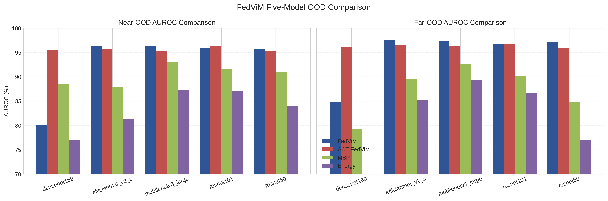
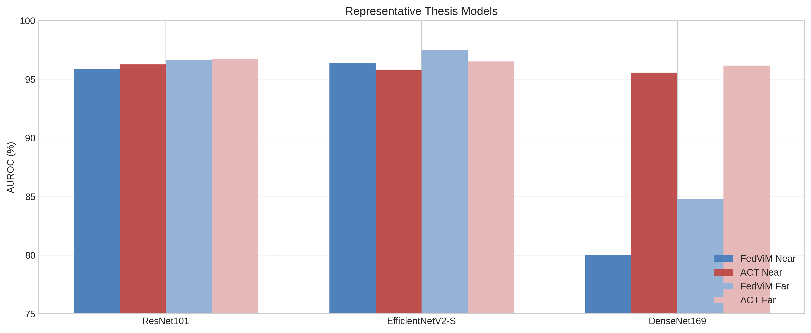
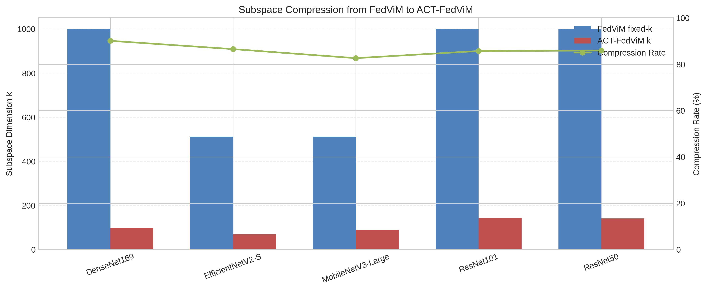

# FedViM：面向海洋浮游生物多中心监测的联邦分布外检测方法研究

## 摘要

海洋浮游生物图像监测通常由多个单位分别建设和维护本地数据中心。由于原始图像及其采样元信息可能关联采样海域、设备布放位置、时间节点和任务背景，跨中心直接汇聚原始数据往往受到数据治理和隐私约束。在此类多中心协作场景下，系统不仅需要完成联邦分类训练，还需要识别未见类别、鱼卵、鱼尾、气泡和颗粒等非目标样本，即分布外（Out-of-Distribution, OOD）样本。

围绕这一需求，本文提出 `FedViM`，面向联邦场景实现 ViM 的后处理式 OOD 检测。ViM 同时利用特征空间结构和分类 logits，在细粒度视觉任务中具有较强的 OOD 判别潜力；更重要的是，它所依赖的全局特征均值、协方差和 logits 与联邦统计量聚合机制天然兼容。为此，本文在联邦训练完成后，由各客户端上传一阶与二阶特征充分统计量，服务器据此重构 ViM 所需的全局均值与协方差，从而在不共享原始图像和样本级特征的条件下完成联邦化 OOD 后处理。

在此基础上，本文进一步提出 `ACT-FedViM` 作为 `FedViM` 的后处理扩展，用 ACT（Adjusted Correlation Thresholding）替代原始 ViM 中的 fixed-k 经验设定，为主子空间维度 `k` 提供统计驱动的自适应选择。该扩展不改变 ViM 仍由协方差主方向构造主子空间的基本框架，仅对“保留多少维主子空间”这一环节进行改进。

本文在基于 DYB-PlanktonNet 构建的 OOD 数据划分上，对 `ResNet101`、`EfficientNetV2-S`、`MobileNetV3-Large`、`DenseNet169` 和 `ResNet50` 五个 CNN backbone 进行了评估。实验包含 `54` 个 ID 类别、`26` 个 Near-OOD 类别和 `12` 个 Far-OOD 类别，并采用 `5` 客户端、Dirichlet `alpha=0.1` 的联邦划分。五模型结果表明，`ACT-FedViM` 的平均 ID 准确率为 `96.48%`。

相较于 fixed-k `FedViM`，ACT-FedViM 的主子空间维度由平均 `804.8` 压缩到 `108.2`，平均压缩率达到 `86.2%`；平均 Near-OOD / Far-OOD AUROC 分别为 `95.64%` / `96.34%`。`FedViM` 与 `ACT-FedViM` 的整体表现均优于 `MSP` 与 `Energy` 基线。

从逐模型结果看，ACT 的收益形态并不完全一致。`DenseNet169` 上出现了较大幅度提升，而在其余 backbone 上，ACT 的作用更多体现在压缩主子空间、减少 fixed-k 的人工设定，并保持有竞争力的检测性能。

研究结果表明，`FedViM` 为多中心敏感图像场景提供了一条可实现的联邦后处理 OOD 检测路径；`ACT-FedViM` 则在此基础上进一步降低了主子空间规模和跨 backbone 手工选维负担，在保持竞争性检测性能的同时提升了部署友好性。

**关键词**：联邦学习；分布外检测；ViM；ACT；海洋浮游生物；图像识别

## Abstract

Marine plankton monitoring is increasingly conducted by multiple institutions that maintain their own local data centers. Because raw images and their metadata may reveal sensitive information about sampling areas, equipment locations, timestamps, and mission backgrounds, directly pooling raw images across centers is often restricted by data governance and privacy requirements. In this multi-center setting, the system must not only perform federated classification, but also detect unseen plankton species, fish eggs, fish tails, bubbles, particles, and other non-target samples, namely out-of-distribution (OOD) samples.

To address this need, this thesis proposes `FedViM`, a federated implementation of post-hoc ViM for OOD detection. ViM is attractive in this task because it combines feature-space structure with classification logits and is well suited to fine-grained visual recognition. More importantly, the global feature mean and covariance required by ViM can be reconstructed from federated sufficient statistics. Accordingly, each client uploads first-order and second-order feature statistics after federated training, and the server reconstructs the global mean and covariance without accessing raw images or sample-level features.

On top of `FedViM`, this thesis further introduces `ACT-FedViM` as a post-hoc extension that replaces the fixed subspace dimension in the original ViM with ACT (Adjusted Correlation Thresholding). This extension keeps the covariance-based principal directions in ViM unchanged and only adapts the choice of the principal subspace dimension `k`.

Experiments are conducted on an OOD split constructed from DYB-PlanktonNet with five CNN backbones: `ResNet101`, `EfficientNetV2-S`, `MobileNetV3-Large`, `DenseNet169`, and `ResNet50`. The evaluation covers `54` in-distribution classes, `26` Near-OOD classes, and `12` Far-OOD classes under a `5`-client federated split with Dirichlet `alpha=0.1`. The five-model results show that `ACT-FedViM` achieves an average ID accuracy of `96.48%`.

Compared with fixed-k `FedViM`, it reduces the average subspace dimension from `804.8` to `108.2`, corresponding to an average compression rate of `86.2%`, while reaching `95.64%` and `96.34%` average AUROC on Near-OOD and Far-OOD tasks, respectively. Both `FedViM` and `ACT-FedViM` outperform the `MSP` and `Energy` baselines by clear margins.

At the model level, the benefits of ACT are not uniform. The largest AUROC improvement appears on `DenseNet169`, while on the remaining backbones the more consistent contribution of ACT lies in subspace compression, reduced manual rank tuning, and deployment-friendly post-hoc inference.

These results indicate that `FedViM` provides a practical federated OOD detection pipeline for privacy-constrained multi-center plankton monitoring, while `ACT-FedViM` further reduces subspace size and manual rank tuning burden without sacrificing competitive detection performance.

**Key words**: federated learning; out-of-distribution detection; ViM; ACT; marine plankton; image recognition

---

## 第1章 引言

### 1.1 研究背景

浮游生物是海洋生态系统中的基础组成部分，其丰度、群落结构和时空分布与营养盐循环、藻华暴发、食物网结构以及海洋生态安全密切相关。随着显微成像设备、流式成像平台和深度学习识别技术的发展，浮游生物监测已经由低通量人工镜检逐步转向高通量图像分析[7-10]。在这一过程中，自动分类模型能够承担越来越多的常规识别任务，但真实部署环境并不是一个封闭、静态的分类场景。

一方面，海洋浮游生物监测往往由不同海域、不同科研平台或不同业务单位分别建设和维护本地数据中心。不同中心在采样环境、成像设备、类别分布和标注进度上存在明显差异，原始图像及其采样元信息还可能关联采样位置、设备布放和任务背景等敏感内容，因此跨中心直接汇聚原始数据并不总是可行。联邦学习通过“数据不动、模型协同”的方式，为此类多中心协作提供了现实可行的技术路径[1][11][12]。

另一方面，海洋浮游生物监测具有显著的开放环境特征。即使分类模型已经学习了训练集中定义的 ID 类别，测试阶段仍可能出现未见浮游生物类别、鱼卵、鱼尾、气泡和颗粒杂波等样本。如果系统对这些样本给出高置信度误判，将直接影响监测结果的可靠性。已有浮游生物识别研究也逐步将这一问题表述为 dataset shift、open-set recognition 或 OOD detection，而不再将其视为单纯的封闭集分类任务[13-15]。因此，在多中心隐私约束下，仅提升联邦分类准确率并不足以支撑实际部署，系统还需要具备面向未知样本的拒识能力。

基于上述背景，本文关注的核心问题是：**在不共享原始图像的多中心海洋浮游生物监测场景下，如何构建可实现、可复用的联邦后处理 OOD 检测方法。**在此基础上，进一步讨论：当该方法依赖主子空间维度选择时，如何减少不同 backbone 之间的手工调参负担。

### 1.2 研究问题与方法动机

围绕上述问题，首先需要回答的是：联邦场景下为什么优先考虑后处理式 OOD 检测。对于已经完成联邦训练的分类 backbone，后处理方法能够在不重新设计训练框架、不引入额外生成模型或辅助分类器的前提下提供 OOD 判别能力，因而更容易与现有多中心监测流程衔接。从工程实现和研究边界看，这类方法也更适合作为联邦分类系统的增量扩展。

在现有后处理方法中，`MSP`[4] 和 `Energy`[5] 是最常见的输出空间基线，分别利用最大 softmax 概率和 logits 的 log-sum-exp 能量进行判别。这类方法实现简单，但主要依赖输出层置信度信息。对于海洋浮游生物图像而言，Near-OOD 样本与 ID 类别往往在形态结构上较为接近，仅依赖输出空间置信度未必足以稳定地区分相近未知类与已知类。

相比之下，ViM[2] 同时利用特征空间结构和分类 logits，通过主子空间与残差空间分解刻画样本偏离 ID 分布的程度，更适合处理具有细粒度特征差异的视觉识别任务。

本文选择 ViM 的一个直接依据，来自 Han 等[13] 在基于 DYB-PlanktonNet 构建的浮游生物 OOD benchmark 上的系统评测。该研究统一比较了 `22` 种 OOD 检测方法，结果显示 ViM 在整体表现上具有较强竞争力，并在 Far-OOD 场景中尤为突出。基于这一结果，本文将 ViM 作为联邦化实现的主方法，而将 `MSP` 与 `Energy` 保留为输出空间对照基线。

对本文而言，ViM 还有一个实现层面的优势：它所依赖的关键统计量是全局特征均值、协方差和分类 logits，而全局均值与协方差可以由客户端上传的一阶与二阶特征充分统计量在服务器端重构。由此，ViM 不仅在任务属性上具有吸引力，也在联邦实现上具备天然适配性。

然而，将 ViM 引入联邦场景后，仍有一个关键问题需要处理。原始 ViM 依赖人为设定固定主子空间维度 `k`。在单一 backbone 条件下，这一经验设定通常可以工作；但在多 backbone、非独立同分布且特征维度差异明显的联邦场景下，固定 `k` 会带来以下局限。

1. 不同 backbone 的特征维度跨度较大，固定 `k` 难以在 `960`、`1280`、`1664` 和 `2048` 维特征之间统一适配。
2. 固定 `k` 缺乏明确的统计依据，难以解释其与当前数据谱结构之间的关系。
3. 当 `k` 取值过大时，部署阶段需要保存的投影矩阵规模和 OOD 打分开销都会增加，不利于后处理模块的轻量化落地。

因此，本文的研究分为两个层次：首先解决 ViM 如何在联邦场景下实现，其次在同一联邦 ViM 框架中讨论主子空间维度 `k` 的自适应选择问题。前者对应本文的主方法 `FedViM`，后者对应其后处理扩展 `ACT-FedViM`。

### 1.3 研究内容与贡献

围绕上述两层问题，本文开展了以下研究。

第一，提出 `FedViM`，将 ViM 的后处理式 OOD 检测流程引入联邦场景。具体做法是：客户端在本地 ID 训练数据上提取特征并上传一阶与二阶充分统计量，服务器据此重构全局特征均值与协方差，从而在不共享原始图像和样本级特征的条件下获得 ViM 所需的全局统计量。

第二，在 `FedViM` 的基础上提出 `ACT-FedViM` 作为后处理扩展。在同一联邦训练 checkpoint 上，引入 ACT 作为主子空间维度选择机制，以统计驱动方式替代原始 ViM 中的 fixed-k 经验设定。该扩展不改变 ViM 通过协方差主方向构造主子空间的基本方式，而是针对维度选择这一关键环节进行改进。

本文的主要贡献可概括为以下三点。

1. 面向多中心敏感图像场景，提出联邦化 ViM 实现方案。各客户端仅上传一阶与二阶特征充分统计量，服务器据此完成全局均值与协方差重构，实现 ViM 所需统计量的联邦化估计。
2. 在 `FedViM` 框架上引入 ACT 作为自适应选维模块，形成 `ACT-FedViM`。该方法以较低实现代价为联邦 ViM 提供了统计驱动的主子空间维度选择机制。
3. 在五个 CNN backbone 上完成系统评估。实验结果表明，`FedViM` 与 `ACT-FedViM` 整体显著优于 `MSP` 与 `Energy` 基线；其中 `ACT-FedViM` 在保持竞争性 OOD 检测性能的同时，将主子空间维度平均压缩 `86.2%`，展示了更好的跨 backbone 适配性与部署友好性。

### 1.4 论文结构

本文后续内容安排如下：第 2 章综述海洋浮游生物图像识别、联邦学习、OOD 检测以及 ViM 与 ACT 相关研究；第 3 章给出 `FedViM` 与 `ACT-FedViM` 的方法设计；第 4 章介绍数据集、联邦设置、backbone 范围、实现细节与评估指标；第 5 章汇报五个 CNN backbone 上的实验结果，并分析 `FedViM` 的整体有效性与 `ACT-FedViM` 的压缩效应；第 6 章讨论本文方法的应用意义、局限性与后续改进方向；第 7 章给出全文结论。

---

## 第2章 相关工作

### 2.1 海洋浮游生物图像识别与监测

浮游生物图像识别是海洋智能监测的重要组成部分。随着显微成像和流式成像技术的发展，研究者已经构建了多个自动分类与识别系统，用于支持高通量浮游生物监测[7-10]。这些研究表明，深度学习方法能够显著提高浮游生物识别效率，但在真实海洋环境中，样本分布会受到海域差异、成像条件、季节变化和设备差异的影响，开放环境中的未知样本问题十分突出。围绕这一问题，已有研究分别从 dataset shift[15] 和 open-set recognition[14] 角度讨论了浮游生物识别系统在实际部署中的失效风险。

与标准图像分类不同，海洋浮游生物监测中的错误往往不仅来自相近物种混淆，还来自气泡、颗粒、鱼卵和残缺目标等“非目标图像”。这意味着模型除了要具备封闭集分类能力，还需要在部署阶段提供足够可靠的拒识能力。由此，OOD 检测成为该应用背景下不可回避的技术需求。

### 2.2 联邦学习与多中心隐私协作

联邦学习由 FedAvg[1] 奠定了最经典的参数平均框架，其核心思想是数据保留在本地、仅交换模型参数或统计量。此后，大量研究从系统效率、优化稳定性、异构性适配和隐私保护等角度扩展了联邦学习的理论与应用边界[11][12]。对于多中心海洋浮游生物监测而言，联邦学习的直接价值在于避免原始图像跨中心汇聚，使系统更符合数据治理要求。

然而，已有联邦学习工作大多将目标集中在分类精度提升上，而对“联邦分类模型如何进行 OOD 后处理”讨论较少。即便有面向联邦 OOD 的工作[6]，其方法也往往依赖额外训练结构或不完全适用于本文所强调的“后处理式、低额外成本、可直接复用现有 backbone”这一约束。因此，如何在联邦场景下构建简洁可复用的 ViM 式 OOD 检测流程，仍有较强的现实意义。

### 2.3 后处理式 OOD 检测方法

后处理式 OOD 检测方法以已经训练完成的分类模型为基础，部署成本低，适合与现有业务模型对接。`MSP`[4] 通过最大 softmax 概率衡量模型置信度，是最基础的 OOD 基线之一；`Energy`[5] 利用 logits 的 log-sum-exp 构造能量分数，在多个视觉任务上表现优于单纯的 softmax 置信度。

ViM[2] 在此基础上进一步引入主子空间与残差空间分解。该方法将特征向量投影到由主成分张成的子空间中，并利用残差范数刻画样本偏离 ID 分布的程度，再与能量项进行组合。ViM 的优点在于：一方面它仍然是后处理式方法，不需要重新训练复杂的生成模型；另一方面它利用了特征空间信息，通常能在细粒度视觉任务中优于单纯依赖输出空间的方法。更重要的是，Han 等[13] 在浮游生物 OOD 检测的系统评测中对 `22` 种方法进行了统一比较，结果显示 ViM 在所构建基准上表现出较强竞争力，并在 Far-OOD 场景中尤为突出。这一结论构成了本文围绕 ViM 展开联邦化实现的直接任务依据。

### 2.4 ACT 与高维统计选维

在高维统计中，当特征维度与样本量处于同一量级时，样本协方差谱容易受到噪声膨胀影响。ACT（Adjusted Correlation Thresholding）通过相关矩阵谱修正和阈值判别，为因子数量估计提供了统计驱动的方案[3]。ACT 的核心作用不是直接构造分类器或 OOD 分数，而是为“应保留多少个有效主方向”提供更有统计解释的选择依据。

在本文中，ACT 被用作 ViM 主子空间维度的自适应选取器。换言之，ACT 所回答的是“选多少维”，而不是“方向如何定义”或“分数如何重构”。这种角色定位既符合 ACT 的统计学背景，也与本文实验观察到的结果一致。

### 2.5 本章小结

综上所述，海洋浮游生物监测需要面向开放环境的可靠识别能力；联邦学习为多中心敏感图像协作提供了基本框架；ViM 为联邦后处理 OOD 检测提供了合适的技术切入点；ACT 则为主子空间维度选择提供了统计驱动基础。本文的工作正是将这四条线索在同一应用问题下加以整合。

---

## 第3章 方法

### 3.1 问题设定

设有 `N` 个客户端，每个客户端对应一个本地数据中心或数据持有单位。客户端 `i` 持有本地有标签 ID 训练集

$$
\mathcal{D}_i = \{(x_j^{(i)}, y_j^{(i)})\}_{j=1}^{n_i},
$$

其中 `x_j^{(i)}` 为浮游生物图像，`y_j^{(i)}` 为 ID 类别标签。各客户端之间不共享原始图像。全局目标是训练一个联邦分类 backbone，并在此基础上构建 OOD 检测器，使系统能够识别测试样本是否来自训练分布之外。

本文的方法并不止于“统计量聚合 + ACT 选维”两步，而是包含四个相互衔接的后处理环节。

1. **联邦统计量重构阶段**：通过联邦训练获得全局 backbone，并由客户端上传一阶与二阶特征统计量，服务器重构 `\mu_{\text{global}}` 与 `\Sigma_{\text{global}}`。
2. **主子空间构造阶段**：`FedViM` 使用 fixed-k 构造主子空间，`ACT-FedViM` 使用 ACT 自适应确定 `k` 后再构造主子空间。
3. **联邦经验 alpha 校准阶段**：在固定 `(f_\theta, P, \mu_{\text{global}})` 后，各客户端分别在本地 ID 训练分片上计算经验能量与残差统计量，服务器聚合得到全局经验 `alpha`。
4. **联邦后处理打分阶段**：服务器使用统一的 `\text{Energy}(x) - \alpha \cdot \text{Residual}(x)` 公式对 ID、Near-OOD 和 Far-OOD 样本进行打分并评估。

这一划分强调：本文关注的不是训练期修改分类框架，而是在**同一联邦分类 checkpoint 上完成 OOD 后处理**。因此，无论 `FedViM` 还是 `ACT-FedViM`，都共享同一个联邦训练 backbone；二者只在主子空间维度 `k` 的选取上不同，而联邦经验 `alpha` 校准与最终打分流程保持一致。

### 3.2 FedViM：ViM 所需统计量的联邦重构

设训练完成后的全局特征提取器为 `f_\theta(\cdot)`，特征维度为 `D`。客户端 `i` 在本地 ID 训练数据上提取特征 `z = f_\theta(x)`，并计算如下充分统计量：

$$
\begin{aligned}
s_i^{(1)} &= \sum_{x \in \mathcal{D}_i} f_\theta(x), \\
s_i^{(2)} &= \sum_{x \in \mathcal{D}_i} f_\theta(x)f_\theta(x)^\top, \\
c_i &= |\mathcal{D}_i|.
\end{aligned}
$$

服务器聚合所有客户端上传的统计量：

$$
\begin{aligned}
S^{(1)} &= \sum_{i=1}^{N} s_i^{(1)}, \\
S^{(2)} &= \sum_{i=1}^{N} s_i^{(2)}, \\
C &= \sum_{i=1}^{N} c_i.
\end{aligned}
$$

据此可重构全局特征均值与协方差：

$$
\mu_{\text{global}} = \frac{S^{(1)}}{C},
\qquad
\Sigma_{\text{global}} = \frac{S^{(2)}}{C} - \mu_{\text{global}}\mu_{\text{global}}^\top.
$$

这一步是本文“联邦化 ViM”的核心。它说明：ViM 所需的全局统计量可以通过聚合充分统计量得到，而不需要服务器访问原始图像或逐样本特征。

### 3.3 FedViM 的 fixed-k 评估口径

在本文中，`FedViM` 专指“联邦化 ViM + fixed-k 评估口径”。考虑到不同 backbone 的特征维度不同，实验中采用与 ViM heuristic 相对应的两档 fixed-k 设定：对于较低维 backbone 采用 `512` 维，对于较高维 backbone 采用 `1000` 维。该设定的目的在于提供清晰、稳定、可复现的实验对照。

因此，本文后续比较中：

- `FedViM` 表示联邦化 ViM 的 fixed-k 版本；
- `ACT-FedViM` 表示在同一联邦 checkpoint 上，用 ACT 替代 fixed-k 来选择 `k` 的版本。

### 3.4 ACT-FedViM：自适应主子空间维度选择

原始 ViM 依赖固定 `k` 来确定主子空间规模。本文将 ACT 引入为对 `k` 的自适应选择机制，但保留 ViM 的整体几何框架。换言之，ACT 只回答“保留多少维主子空间”，并不改变“主方向来自协方差主成分”的事实。

首先将全局协方差矩阵转换为相关矩阵：

$$
R = D_\Sigma^{-1/2}\Sigma_{\text{global}}D_\Sigma^{-1/2},
$$

其中 `D_\Sigma` 为 `\Sigma_{\text{global}}` 对角元素构成的对角矩阵。对 `R` 进行特征分解，记降序特征值为

$$
\lambda_1 \ge \lambda_2 \ge \cdots \ge \lambda_p.
$$

根据 ACT，定义阈值

$$
s = 1 + \sqrt{\frac{p}{n-1}},
$$

并通过离散 Stieltjes 变换对样本特征值进行偏差修正，得到修正特征值 `\lambda_j^C`。最终采用如下规则确定自适应维度：

$$
k_{\text{ACT}} = \max\{j : \lambda_j^C > s\}.
$$

在得到 `k_{\text{ACT}}` 后，仍然对 `\Sigma_{\text{global}}` 做 PCA，并取前 `k_{\text{ACT}}` 个协方差主方向构造 ViM 主子空间矩阵

$$
P \in \mathbb{R}^{D \times k_{\text{ACT}}}.
$$

因此，ACT-FedViM 的本质可以概括为：

> 先用联邦统计量重构 ViM 所需的全局协方差，再用 ACT 自动确定 ViM 的主子空间维度 `k`。

### 3.5 ViM 打分与联邦经验校准

给定测试样本 `x`，设其特征为 `z = f_\theta(x)`，分类头输出 logits 为 `g_\theta(x)`。ViM 残差定义为

$$
\text{Residual}(x) = \left\| (I - PP^\top)(z - \mu_{\text{global}}) \right\|_2.
$$

能量项定义为

$$
\text{Energy}(x) = \log \sum_{c=1}^{C} \exp(g_\theta(x)_c).
$$

本文采用经验校准得到平衡系数 `alpha`：

$$
\alpha = \frac{|\mathbb{E}_{ID}[\text{Energy}(x)]|}{\mathbb{E}_{ID}[\text{Residual}(x)] + \epsilon}.
$$

需要强调的是，这里的期望不是集中式服务器直接访问全部 ID 训练样本后计算得到，而是通过**联邦式后处理校准**获得。这里使用的仍然是第 3.1 节定义的本地 ID 训练集 `\mathcal{D}_i`。在主子空间 `P` 与全局均值 `\mu_{\text{global}}` 已经固定后，第 `i` 个客户端仅在本地数据上计算三项标量统计量：

$$
S_i^{E} = \sum_{x \in \mathcal{D}_i} \text{Energy}(x), \qquad
S_i^{R} = \sum_{x \in \mathcal{D}_i} \text{Residual}(x), \qquad
n_i = |\mathcal{D}_i|.
$$

与第 3.2 节中用于重构 `\mu_{\text{global}}` 和 `\Sigma_{\text{global}}` 的特征充分统计量不同，本阶段上传的是在固定 `(f_\theta, P, \mu_{\text{global}})` 后得到的能量与残差标量统计量。因此，`alpha` 的估计仍属于联邦后处理的一部分，但它对应的是后处理链条中的第二轮聚合。

服务器聚合所有客户端上传的结果：

$$
S^{E} = \sum_{i=1}^{N} S_i^{E}, \qquad
S^{R} = \sum_{i=1}^{N} S_i^{R}, \qquad
n = \sum_{i=1}^{N} n_i.
$$

于是，全局经验能量均值和全局经验残差均值可写为

$$
\mathbb{E}_{ID}[\text{Energy}(x)] \approx \frac{S^{E}}{n}, \qquad
\mathbb{E}_{ID}[\text{Residual}(x)] \approx \frac{S^{R}}{n}.
$$

进一步得到联邦经验校准系数

$$
\alpha = \frac{|S^{E}/n|}{S^{R}/n + \epsilon}.
$$

由此，`alpha` 的估计与前述 `\mu_{\text{global}}`、`\Sigma_{\text{global}}` 的重构属于同一条联邦后处理链：前者聚合的是一阶与二阶特征充分统计量，后者聚合的是在固定 `(f_\theta, P, \mu_{\text{global}})` 条件下得到的能量与残差标量统计量。两者都不需要上传原始图像或样本级特征，只是服务于后处理中的不同环节。

最终 OOD 分数写为

$$
\text{Score}(x) = \text{Energy}(x) - \alpha \cdot \text{Residual}(x).
$$

得分越低，样本越可能偏离 ID 主子空间；在 AUROC 评估时，将该分数统一转换为 OOD score 即可。由此，`FedViM` 与 `ACT-FedViM` 的差别仅在于主子空间 `P` 的构造方式不同，而经验 `alpha` 的联邦校准流程保持一致。

### 3.6 方法流程与复杂度分析

从实现角度看，FedViM 与 ACT-FedViM 的完整流程可以概括为：

1. 使用 FedAvg 对 backbone 进行联邦训练。
2. 每个客户端在本地 ID 训练集上计算并上传一阶与二阶特征统计量。
3. 服务器重构全局均值与协方差。
4. 对于 `FedViM`，使用 fixed-k 构造主子空间；对于 `ACT-FedViM`，先由 ACT 计算 `k_{\text{ACT}}`，再构造主子空间。
5. 在固定 `(f_\theta, P, \mu_{\text{global}})` 后，各客户端分别在本地 ID 训练分片上计算 `\sum \text{Energy}`、`\sum \text{Residual}` 与样本数，并上传到服务器。
6. 服务器聚合上述标量统计量，得到全局经验 `alpha`。
7. 使用 `Energy - alpha * Residual` 计算 OOD 分数并评估 Near/Far-OOD AUROC。

ACT-FedViM 的轻量化收益主要发生在**后处理与部署阶段**，而不是联邦训练上传阶段。原因在于：

1. 客户端上传的一阶与二阶统计量由特征维度 `D` 决定，与最终选择的 `k` 无关。
2. 经验 `alpha` 校准阶段上传的是三个标量统计量 `(S_i^{E}, S_i^{R}, n_i)`，其通信成本与最终选择的 `k` 也无关。
3. 但部署时需要保存和使用的主子空间矩阵规模为 `D \times k`。
4. ViM 打分中的投影与残差计算复杂度近似为 `O(Dk)`。

`k` 的显著降低会直接减少投影矩阵存储开销和 OOD 打分时的矩阵乘法开销。本文五模型正式结果中，fixed-k FedViM 的平均 `k` 为 `804.8`，而 ACT-FedViM 的平均 `k` 为 `108.2`，后处理阶段的主子空间规模被压缩了约 `86.2%`。

### 3.7 方法边界

本文的方法不上传原始图像，也不上传逐样本特征，只上传客户端内部聚合后的统计量。因此，它比集中式汇聚图像或收集全部训练特征的方案更符合多中心数据协作要求。

需要指出的是，该方案避免了原始图像和样本级特征上传，但尚未给出形式化差分隐私保证。ACT-FedViM 的隐私优势主要体现在：

1. 原始图像和采样位置等敏感数据不出本地。
2. 服务器仅接收聚合统计量而非样本级记录。
3. 方法结构与后续引入安全聚合或差分隐私机制是兼容的。

### 3.8 本章小结

本章给出了 FedViM 与 ACT-FedViM 的完整方法定义。FedViM 解决的是 ViM 所需统计量、主子空间以及经验 `alpha` 如何在联邦场景下以后处理方式完成估计的问题；ACT-FedViM 则进一步解决了在同一联邦 ViM 框架中如何自适应选择主子空间维度 `k` 的问题。两者前后衔接清晰，也构成了本文论文叙事的主线。

---

## 第4章 实验设计

### 4.1 数据集与 OOD 划分

本文实验基于 Li 等发布于 IEEE Dataport 的 `DYB-PlanktonNet` 数据集[16] 构建 OOD 划分。具体实现中，实验数据组织为以下四个部分：

- `D_ID_train`：`54` 个 ID 类别，共 `26,034` 张图像；
- `D_ID_test`：`54` 个 ID 类别，共 `2,939` 张图像；
- `D_Near_test`：`26` 个 Near-OOD 类别，共 `1,516` 张图像；
- `D_Far_test`：`12` 个 Far-OOD 类别，共 `17,031` 张图像。

在训练阶段，本文从 `D_ID_train` 中固定划出 `10%` 样本作为服务端验证集，用于 early stopping 与最佳 checkpoint 选择；`D_ID_test`、`D_Near_test` 与 `D_Far_test` 仅用于最终评估，不参与模型选择。

Near-OOD 由与 ID 浮游生物在形态或生态属性上相近、但不属于训练目标的类别组成；Far-OOD 则包含鱼卵、鱼尾、气泡和多类颗粒杂波。这一划分同时覆盖了“相近未知类”和“明显非目标类”两种更贴近实际部署的 OOD 场景。

### 4.2 联邦设置

训练集通过 Dirichlet 分布划分到 `5` 个客户端，参数取 `alpha = 0.1`，以模拟高度异构的多中心场景。全局训练采用 FedAvg 聚合，客户端参与比例设为 `1.0`，即每一轮均使用全部客户端参与参数更新。正式训练统一采用 `50` 个通信轮次，每轮执行 `4` 个本地 epoch。

从本文的研究目标出发，联邦训练主要承担为后处理 OOD 评估提供稳定 checkpoint 和特征统计量的基础作用。因此，实验重点放在“联邦 ViM 是否可行”以及“ACT 是否能在同一 checkpoint 上提供更合理的选维”这两个问题上。

### 4.3 Backbone 范围与方法对照

考虑到本文聚焦于 ACT 在卷积特征空间中的作用，正式实验 backbone 收敛到 `5` 个 CNN 模型：

- `ResNet101`
- `EfficientNetV2-S`
- `MobileNetV3-Large`
- `DenseNet169`
- `ResNet50`

Transformer、DeiT 和 ConvNeXt 等模型不再进入论文主结果。这一处理的原因有两点：

1. 本文的主要方法学问题已经能够在 CNN 特征空间内得到充分验证。
2. 将实验范围收敛到五个 CNN backbone，有利于保证论文叙事、代码主线和结果表述的一致性。

本文比较的四类方法如下。

1. `MSP`：最大 softmax 概率基线。
2. `Energy`：基于 logits 能量的输出空间基线。
3. `FedViM`：联邦化 ViM 的 fixed-k 版本。
4. `ACT-FedViM`：在同一联邦 checkpoint 上用 ACT 自动选择 `k` 的版本。

### 4.4 训练与实现细节

在本文实验设置中，五个 CNN backbone 采用统一的基础训练框架，但在 batch size 与梯度累积上略有差异。主要配置如下：

- 全局随机种子为 `42`；
- 训练轮次为 `50`，本地 epoch 为 `4`；
- 基础学习率为 `0.001`，在 SGD 情况下自动按 `×10` 放大为有效学习率；
- 优化器采用带动量的 SGD，动量为 `0.9`，权重衰减为 `1e-4`；
- 学习率调度采用 `5` 轮 warmup 加 cosine decay；
- `ResNet101` 使用 batch size `16` 且梯度累积 `4` 步；
- `MobileNetV3-Large` 使用 batch size `64`；
- `DenseNet169`、`EfficientNetV2-S`、`ResNet50` 使用 batch size `32`。

在后处理评估中，`FedViM` 使用 fixed-k 口径；`ACT-FedViM` 仅改变 `k` 的选取方式，其他统计量、特征提取器和经验 `alpha` 校准过程与 `FedViM` 保持一致。这样可以最大程度保证两者比较的可解释性。

### 4.5 评估指标

本文使用以下四类指标：

1. ID 分类准确率（Accuracy），用于衡量联邦分类 backbone 在 ID 测试集上的基础识别能力。
2. Near-OOD AUROC，用于衡量模型对“相近未知类别”的区分能力。
3. Far-OOD AUROC，用于衡量模型对“明显非目标样本”的区分能力。
4. 主子空间压缩率，用于衡量 ACT 相对 fixed-k 在后处理维度上的压缩效果。

其中，压缩率定义为

$$
\text{Compression} = 1 - \frac{k_{\text{ACT}}}{k_{\text{fixed}}}.
$$

### 4.6 实验报告口径

正文结果采用单次种子实验结果。为保持口径统一，平均值来自五模型汇总结果，代表模型分析则直接引用对应模型的结构化结果文件。由此，实验结果章节能够同时兼顾整体比较与个案分析两种叙述需求。

### 4.7 本章小结

本章从数据集、联邦设置、backbone 范围、实现细节和评估指标五个方面说明了实验设计。总体上，实验配置服务于一个明确目标：在五个 CNN backbone 上验证 FedViM 的联邦可行性，以及 ACT-FedViM 的自适应选维价值。

---

## 第5章 实验结果与分析

### 5.1 五模型总体结果

表 5-1 给出了五个 CNN backbone 的主要结果。由于 OOD 检测是基于同一分类 checkpoint 的后处理评估，ID 分类准确率对 `FedViM` 与 `ACT-FedViM` 是共享的。

**表 5-1 五个 CNN backbone 上的主要结果**

| 模型 | ID Acc (%) | FedViM k | ACT k | 压缩率 | FedViM Near (%) | ACT Near (%) | FedViM Far (%) | ACT Far (%) |
| --- | --- | --- | --- | --- | --- | --- | --- | --- |
| DenseNet169 | 96.50 | 1000 | 99 | 90.1% | 80.04 | 95.57 | 84.78 | 96.17 |
| EfficientNetV2-S | 97.01 | 512 | 69 | 86.5% | 96.40 | 95.77 | 97.52 | 96.51 |
| MobileNetV3-Large | 96.16 | 512 | 89 | 82.6% | 96.31 | 95.26 | 97.34 | 96.42 |
| ResNet101 | 96.22 | 1000 | 143 | 85.7% | 95.86 | 96.28 | 96.68 | 96.73 |
| ResNet50 | 96.53 | 1000 | 141 | 85.9% | 95.68 | 95.32 | 97.19 | 95.89 |
| **平均** | **96.48** | **804.8** | **108.2** | **86.2%** | **92.86** | **95.64** | **94.70** | **96.34** |

从表 5-1 可以先得到两点直接结果。

第一，ACT-FedViM 的最稳定收益来自**主子空间压缩**。在五个模型上，ACT 均将 `k` 压缩到 `69` 到 `143` 的范围，平均压缩率达到 `86.2%`，这说明 ACT 在卷积 backbone 上确实提供了稳定的一致性轻量化效果。

第二，ACT-FedViM 的平均 AUROC 高于 fixed-k FedViM，但这种提升并不均匀。从逐模型结果看，ACT 在 Near-OOD 与 Far-OOD 上仅在部分模型上优于 fixed-k FedViM，在另外一些模型上则出现了不同程度的波动。这说明，ACT 的收益形态需要结合具体 backbone 进一步分析，而不能只由平均值概括。

### 5.2 与 MSP、Energy 基线的整体比较

为了说明联邦 ViM 系方法的整体有效性，表 5-2 给出了四类方法在五模型上的平均表现。

**表 5-2 不同方法的平均 OOD 检测表现**

| 方法 | 平均 Near-OOD AUROC (%) | 平均 Far-OOD AUROC (%) |
| --- | --- | --- |
| MSP | 90.42 | 87.27 |
| Energy | 83.34 | 80.89 |
| FedViM | 92.86 | 94.70 |
| ACT-FedViM | 95.64 | 96.34 |

*图 5-1 五个 CNN backbone 上 `FedViM`、`ACT-FedViM`、`MSP` 与 `Energy` 的 Near/Far-OOD AUROC 对比。*

从表 5-2 和图 5-1 可以看出，`MSP` 与 `Energy` 作为纯输出空间基线，在当前细粒度浮游生物任务上明显弱于 ViM 系方法。以平均结果计，`FedViM` 相比 `MSP` 的 Near/Far-OOD AUROC 分别提升 `2.44` 和 `7.43` 个百分点，相比 `Energy` 分别提升 `9.51` 和 `13.82` 个百分点；`ACT-FedViM` 相比 `MSP` 的 Near/Far-OOD AUROC 分别提升 `5.22` 和 `9.08` 个百分点，相比 `Energy` 分别提升 `12.30` 和 `15.46` 个百分点。这些结果首先说明，联邦化 ViM 本身已经明显优于纯输出空间基线；在此基础上再引入 ACT 后，平均性能进一步提升。也就是说，后续对 ACT-FedViM 的分析，是建立在 `FedViM` 已经具有整体有效性的前提之上的。

### 5.3 代表模型案例分析

为更全面展示 ACT-FedViM 在不同 backbone 上的表现形态，本文按“现象覆盖”原则选取 `3` 个代表模型，而非按性能排名筛选。三者分别对应以下三类典型情形：

1. `MobileNetV3-Large`：用于展示“大幅压缩 k，但整体性能只出现有限波动”的轻量化案例；
2. `ResNet101`：用于展示“压缩显著且性能基本持平甚至略优”的平衡型案例；
3. `DenseNet169`：用于展示“fixed-k 与自适应选维结果差异较大”的代表案例。

#### 5.3.1 MobileNetV3-Large：轻量化收益最直观

`MobileNetV3-Large` 的 fixed-k 为 `512`，ACT 选择 `89` 维，压缩率达到 `82.6%`。与此同时，Near-OOD AUROC 从 `96.31%` 变化到 `95.26%`，Far-OOD AUROC 从 `97.34%` 变化到 `96.42%`。这一结果说明，在较轻量的卷积 backbone 上，ACT 的主要作用并不一定体现为继续抬高 AUROC，而更多体现为在维持较高绝对性能的同时显著缩小主子空间规模。对于部署阶段而言，`k` 从 `512` 压缩到 `89` 意味着投影矩阵存储量和投影计算开销都明显下降。

#### 5.3.2 ResNet101：压缩与性能兼顾的平衡案例

`ResNet101` 的 fixed-k 为 `1000`，ACT 选择 `143` 维，压缩率为 `85.7%`。在这一更小主子空间下，Near-OOD AUROC 从 `95.86%` 提升到 `96.28%`，Far-OOD AUROC 从 `96.68%` 变化到 `96.73%`。这一结果表明，在高维 CNN backbone 上，ACT-FedViM 可以在显著缩小子空间规模的同时保持与 fixed-k ViM 基本一致的检测能力，并取得轻微增益。与 `MobileNetV3-Large` 相比，`ResNet101` 更能体现“压缩显著而性能基本持平”的平衡特征。

#### 5.3.3 DenseNet169：fixed-k 与 ACT 差异最明显的案例

`DenseNet169` 的结果与其他模型明显不同。其 fixed-k 为 `1000`，而 ACT 仅保留 `99` 维主子空间，压缩率达到 `90.1%`。在这一设定下，Near-OOD AUROC 从 `80.04%` 提升到 `95.57%`，Far-OOD AUROC 从 `84.78%` 提升到 `96.17%`。从当前结果看，这一模型上 fixed-k 与 ACT 之间的差异最为显著，ACT 版本在该案例中获得了更好的检测结果。

`DenseNet169` 可以视为一个对 fixed-k 较为敏感的代表案例，而不是 ACT 在所有模型上的普遍收益。当固定 `k` 与具体 backbone 的谱结构匹配较差时，自适应选维可能带来更明显的改善；在其余模型上，ACT 的收益则更多表现为压缩和稳健性。就本文结果而言，这一案例主要提示了 fixed-k 方案在个别 backbone 上可能存在的风险。

*图 5-2 `MobileNetV3-Large`、`ResNet101` 与 `DenseNet169` 三个代表模型上的 Near/Far-OOD AUROC 对比。*

图 5-2 从可视化角度进一步说明了三类代表模型的差异。`MobileNetV3-Large` 对应“高性能前提下的大幅压缩”，`ResNet101` 对应“压缩与性能的均衡”，而 `DenseNet169` 则体现了 fixed-k 与自适应选维结果之间的显著差异。

### 5.4 ACT 的压缩效应与实际部署意义

*图 5-3 五个 CNN backbone 上 fixed-k FedViM 与 ACT-FedViM 的主子空间维度比较。*

从图 5-3 可以更直观看到，ACT 在五个模型上都显著降低了主子空间维度。对本文而言，这一结果具有两层意义。

第一，ACT 在不同 CNN backbone 上体现出较高的一致性。虽然 AUROC 的变化并不一致，但 `k` 的压缩方向是一致的，这说明 ACT 作为选维机制的作用是稳定的。

第二，主子空间规模的降低直接对应部署阶段成本下降。ViM 需要保存主子空间矩阵 `P \in \mathbb{R}^{D \times k}`，并在打分时计算投影和残差。`k` 的显著下降意味着矩阵更小、打分更快、内存更省。因此，ACT-FedViM 的价值主要不在训练阶段通信，而在后处理阶段的轻量化落地。

### 5.5 ACT 收益差异的解释性分析

从表 5-1 可以看出，ACT-FedViM 并没有在所有 backbone 上都表现出一致的 AUROC 提升。对于这一现象，本文给出以下解释性分析；这些分析主要用于帮助理解结果形态，并不构成额外实验验证后的机制结论。

第一，ACT 只负责选择 `k`，而最终主方向仍然来自协方差 PCA。因此，“更有统计依据地选择 `k`”并不必然转化为“更高的 AUROC”。当 OOD 判别信息与协方差主方向之间并不完全一致时，更合适的维度选择也可能主要体现为压缩收益，而不是检测性能提升。

第二，不同 backbone 对 fixed-k 的敏感程度可能不同。从当前结果看，`DenseNet169` 上 fixed-k 与 ACT 之间的差异最为明显；而在 `ResNet101`、`MobileNetV3-Large` 等模型上，ACT 的收益则更多表现为在压缩子空间的同时尽量维持原有性能。至于这种差异是否对应更具体的谱结构失配，还需要结合额外的谱分布或特征值统计进一步验证。

第三，平均值会受到个别模型的显著影响。本文中 `DenseNet169` 上的较大差异明显拉高了 ACT 的平均 AUROC；若剔除这一模型，ACT 相对 FedViM 的平均变化约为 Near `-0.40` 个百分点、Far `-0.79` 个百分点。

从本章结果更直接支持的结论是：`ACT-FedViM` 在部分 backbone 上可以改善 fixed-k 的表现，在多数 backbone 上则主要提供更自动、更紧凑的后处理选维。

### 5.6 本章小结

本章结果表明，`FedViM` 与 `ACT-FedViM` 在五个 CNN backbone 上都明显优于 `MSP` 与 `Energy`，联邦化 ViM 的主线是成立的。进一步地，ACT-FedViM 在所有 backbone 上都显著压缩了主子空间规模，并在五模型结果中保持了竞争性的 OOD 检测性能。就本章而言，更应强调的是：ACT 为联邦 ViM 提供了更自动、更轻量的后处理选维方式，并在部分模型上呈现出对 fixed-k 敏感情形的改善。

---

## 第6章 讨论

### 6.1 方法定位

本文将 `ACT-FedViM` 定位为 `FedViM` 的后处理增强方案，而不是独立于 ViM 的全新 OOD 检测框架。相应地，本文的主问题是联邦场景下如何实现 ViM 所需统计量与后处理评分流程，`ACT` 则用于进一步改进其中的主子空间维度选择环节。

这一定位有助于保持方法结构、实验设计与论文题目的一致性。就方法构成而言，核心贡献集中在联邦统计量重构与自适应选维两个层面，不需要额外引入复杂训练模块；就实验结果而言，`FedViM` 与 `ACT-FedViM` 的关系也更适合被理解为“主方法与后处理扩展”，而非两个并列的新框架。

### 6.2 面向多中心海洋监测的实际意义

结合本文场景，`FedViM` 与 `ACT-FedViM` 的实际意义主要体现在三个方面。

第一，满足多中心数据协作的基本约束。原始图像和样本级特征保留在本地，服务器只聚合一阶与二阶统计量，这使方法更符合海洋监测的数据治理要求。

第二，为联邦分类系统补充开放环境能力。实际海洋监测任务中，系统不仅要识别训练集中的已知类，还要尽量拒识未知类和非目标样本。`FedViM` 使这一需求在联邦场景下具备了可实现的后处理路径。

第三，降低后处理部署成本。`ACT` 不改变联邦训练阶段的统计量上传规模，但显著缩小了部署阶段需要保存的主子空间矩阵，并降低了 OOD 打分时的投影计算复杂度。在当前五模型结果中，这一压缩效应具有较高一致性。

### 6.3 研究局限

本文当前工作仍存在以下局限。

1. 当前方法只改进了主子空间维度 `k` 的选择，没有改变主方向本身的构造方式。因此，当协方差主方向与 OOD 判别方向不完全一致时，ACT 的收益会受到限制。
2. 虽然方法避免了原始图像跨中心传输，但尚未结合安全聚合或差分隐私机制给出形式化隐私保证。
3. 实验范围目前收敛到五个 CNN backbone，尚未扩展到 Transformer、ConvNeXt 或多模态海洋监测场景。

### 6.4 后续工作展望

未来工作可以从以下几个方向继续推进。

1. 在保持联邦统计量可聚合的前提下，探索比协方差 PCA 更贴近 OOD 判别结构的方向选择机制。
2. 在联邦聚合过程中加入安全聚合或差分隐私扰动，进一步增强形式化隐私保护能力。
3. 在多种子、多数据划分条件下验证 ACT-FedViM 的稳定性，给出更完整的统计报告。
4. 将方法扩展到图像与环境传感数据联合建模的多模态海洋监测任务。

### 6.5 本章小结

本章从方法定位、应用意义与研究局限三个方面对实验结果进行了讨论。总体来看，`FedViM` 的价值在于提供联邦后处理 OOD 检测的可实现路径，`ACT-FedViM` 的价值在于在此基础上进一步降低主子空间规模与手工选维负担。

---

## 第7章 结论

本文围绕“多中心敏感图像不能直接共享、系统又需要具备 OOD 拒识能力”这一问题，提出了 `FedViM`，并进一步给出其后处理扩展 `ACT-FedViM`。前者通过联邦聚合一阶与二阶充分统计量，实现 ViM 所需全局均值与协方差的联邦化估计；后者在同一 checkpoint 上利用 ACT 自动选择 ViM 主子空间维度 `k`，从而构造出一套统计驱动的联邦 ViM 后处理流程。

在基于 `DYB-PlanktonNet` 构建的 OOD 划分上，本文对 `5` 个 CNN backbone 进行了实验评估，其中包含 `54` 个 ID 类别、`26` 个 Near-OOD 类别和 `12` 个 Far-OOD 类别。五模型正式结果表明，ACT-FedViM 的平均 ID 准确率达到 `96.48%`；相较于 fixed-k FedViM，ACT 将主子空间维度平均从 `804.8` 压缩到 `108.2`，压缩率达到 `86.2%`；同时，平均 Near/Far-OOD AUROC 达到 `95.64% / 96.34%`，并整体显著优于 `MSP` 与 `Energy` 基线。

综合本文的方法设计与实验结果，可以得到以下结论：

1. ViM 所需的全局统计量可以通过联邦充分统计量聚合完成重构，从而形成可实现的联邦后处理 OOD 检测流程。
2. ACT 可以作为联邦 ViM 的自适应选维模块接入同一 checkpoint 下的后处理评估，并为主子空间维度选择提供统计驱动依据。
3. `ACT-FedViM` 在显著压缩后处理主子空间规模的同时，保持了有竞争力的 OOD 检测性能；其收益形态在不同 backbone 上并不完全一致，但在压缩效应与部署友好性方面具有稳定优势。

上述结论共同说明，`FedViM` 为多中心敏感图像场景下的联邦 OOD 检测提供了可行方案，而 `ACT-FedViM` 则进一步提升了这一方案在跨 backbone 场景中的适配性与轻量化程度。

---

## 参考文献

1. McMahan B, Moore E, Ramage D, et al. Communication-efficient learning of deep networks from decentralized data[C]//*Proceedings of AISTATS*. 2017.
2. Wang H Q, Li Z, Feng L, et al. ViM: Out-of-distribution with virtual-logit matching[C]//*Proceedings of CVPR*. 2022.
3. Fan J, Ke Y, Wang K, et al. Estimating number of factors by adjusted eigenvalues thresholding[J]. *Journal of the American Statistical Association*, 2022, 117(538): 852-861.
4. Hendrycks D, Gimpel K. A baseline for detecting misclassified and out-of-distribution examples in neural networks[C]//*ICLR Workshop*. 2017.
5. Liu W, Wang X, Owens J, et al. Energy-based out-of-distribution detection[J]. *NeurIPS*, 2020.
6. Liao X, Liu W, Zhou P, et al. FOOGD: Federated collaboration for both out-of-distribution generalization and detection[C]//*NeurIPS*. 2024.
7. Eerola T, et al. Survey of automatic plankton image recognition: challenges, existing solutions and future perspectives[J]. *Artificial Intelligence Review*, 2024.
8. Pitois S G, et al. RAPID: real-time automated plankton identification dashboard using edge AI at sea[J]. *Frontiers in Marine Science*, 2025.
9. Schmid M S, et al. Edge computing at sea: high-throughput classification of in-situ plankton imagery for adaptive sampling[J]. *Frontiers in Marine Science*, 2023.
10. Naselli-Flores L, Padisak J. Ecosystem services provided by marine and freshwater phytoplankton[J]. *Hydrobiologia*, 2023.
11. Kairouz P, McMahan H B, Avent B, et al. Advances and open problems in federated learning[J]. *Foundations and Trends in Machine Learning*, 2021, 14(1-2): 1-210.
12. Yang Q, Liu Y, Chen T, et al. Federated machine learning: Concept and applications[J]. *ACM Transactions on Intelligent Systems and Technology*, 2019, 10(2): 1-19.
13. Han Y, He J, Xie C, et al. Benchmarking out-of-distribution detection for plankton recognition: A systematic evaluation of advanced methods in marine ecological monitoring[C]//*Proceedings of the IEEE/CVF International Conference on Computer Vision (ICCV) Workshops*. 2025: 2142-2152.
14. Kareinen J, Skyttä A, Eerola T, et al. Open-set plankton recognition[C]//Del Bue A, Leal-Taixe L, as eds. *Computer Vision - ECCV 2024 Workshops*. Lecture Notes in Computer Science, vol 15640. Cham: Springer, 2025: 168-184.
15. Chen C, Kyathanahally S P, Reyes M, et al. Producing plankton classifiers that are robust to dataset shift[J]. *Limnology and Oceanography: Methods*, 2024, 23(1): 39-66.
16. Li J, Yang Z, Chen T. DYB-PlanktonNet[DB/OL]. IEEE Dataport, 2021. doi:10.21227/875n-f104.

---

## 附录

### A.1 全局协方差重构公式

设客户端 `i` 的本地特征为 `\{z_j^{(i)}\}_{j=1}^{n_i}`，则有

$$
\begin{aligned}
S^{(1)} &= \sum_{i=1}^{N}\sum_{j=1}^{n_i} z_j^{(i)}, \\
S^{(2)} &= \sum_{i=1}^{N}\sum_{j=1}^{n_i} z_j^{(i)}(z_j^{(i)})^\top.
\end{aligned}
$$

由此得到

$$
\mu_{\text{global}} = \frac{S^{(1)}}{\sum_i n_i},
\qquad
\Sigma_{\text{global}} = \frac{S^{(2)}}{\sum_i n_i} - \mu_{\text{global}}\mu_{\text{global}}^\top.
$$

因此，ViM 所需的全局统计量可以在联邦场景下通过充分统计量无损重构。

### A.2 ACT 选维规则

设相关矩阵特征值为 `\lambda_1 \ge \cdots \ge \lambda_p`，ACT 对特征值进行偏差修正得到 `\lambda_j^C`，并采用

$$
k_{\text{ACT}} = \max \{j : \lambda_j^C > 1 + \sqrt{p/(n-1)}\}
$$

作为主子空间维度。本文利用该规则为 ViM 的 `k` 提供自适应选择，而不改变 ViM 的主方向提取方式。

### A.3 五模型完整备份结果

| 模型 | ID Acc (%) | FedViM k | ACT k | 压缩率 | FedViM Near (%) | ACT Near (%) | MSP Near (%) | Energy Near (%) | FedViM Far (%) | ACT Far (%) | MSP Far (%) | Energy Far (%) |
| --- | --- | --- | --- | --- | --- | --- | --- | --- | --- | --- | --- | --- |
| DenseNet169 | 96.50 | 1000 | 99 | 90.1% | 80.04 | 95.57 | 88.60 | 77.11 | 84.78 | 96.17 | 79.22 | 66.15 |
| EfficientNetV2-S | 97.01 | 512 | 69 | 86.5% | 96.40 | 95.77 | 87.83 | 81.36 | 97.52 | 96.51 | 89.62 | 85.24 |
| MobileNetV3-Large | 96.16 | 512 | 89 | 82.6% | 96.31 | 95.26 | 93.05 | 87.23 | 97.34 | 96.42 | 92.56 | 89.42 |
| ResNet101 | 96.22 | 1000 | 143 | 85.7% | 95.86 | 96.28 | 91.59 | 87.06 | 96.68 | 96.73 | 90.12 | 86.65 |
| ResNet50 | 96.53 | 1000 | 141 | 85.9% | 95.68 | 95.32 | 91.02 | 83.97 | 97.19 | 95.89 | 84.82 | 76.97 |

---

**论文版本**：v4.7  
**日期**：2026-03-31  
**说明**：本稿按照“FedViM + ACT 自适应选维”的五模型主线重写，并采用五模型正式结果作为正文数字基线。  
