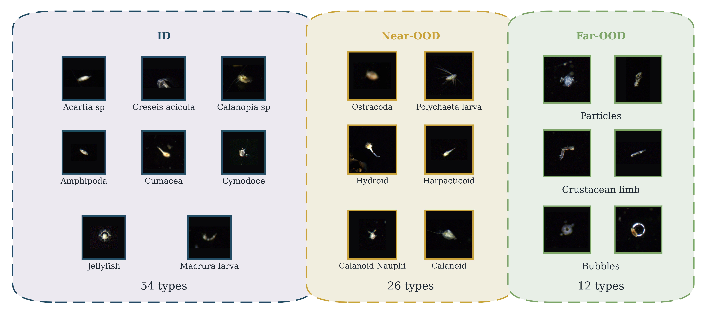
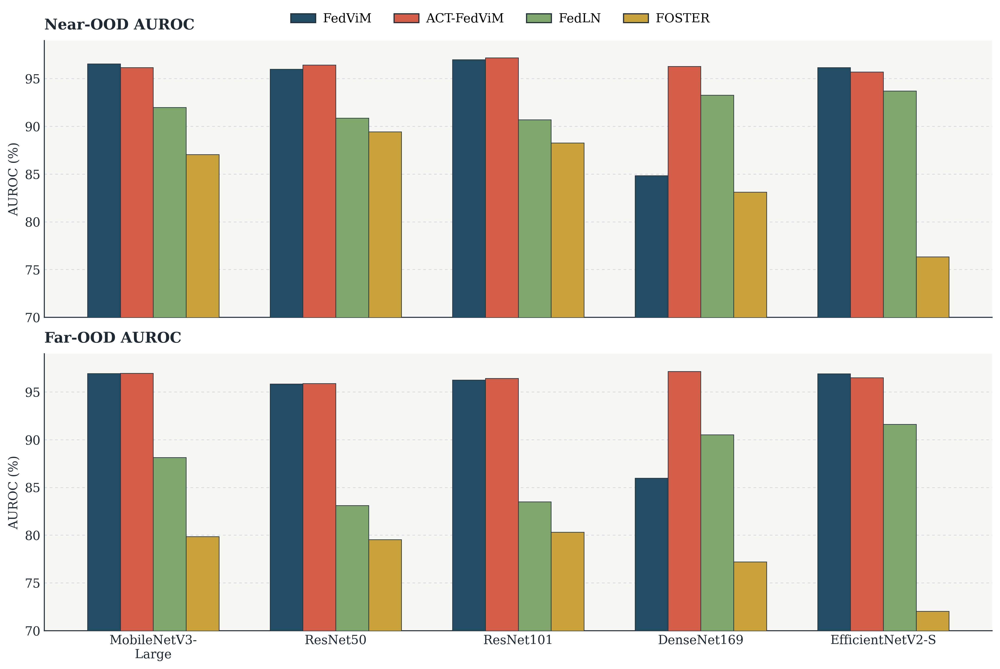
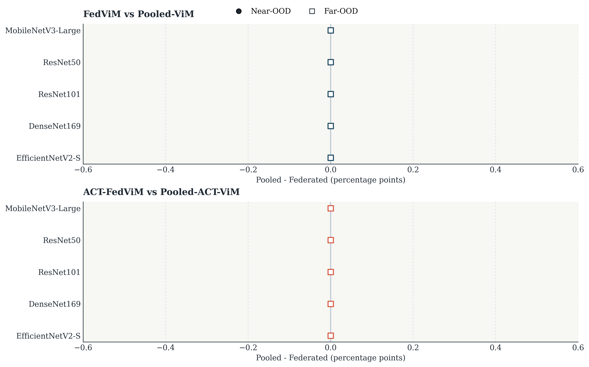
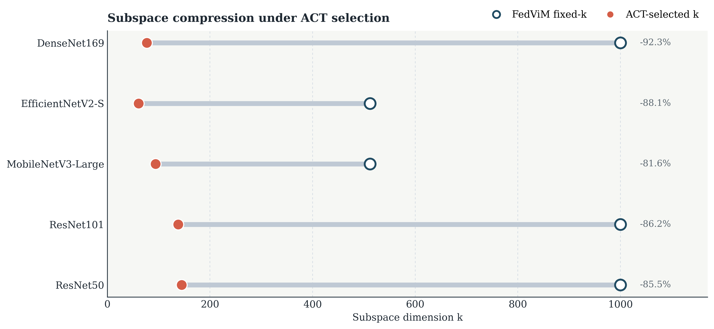
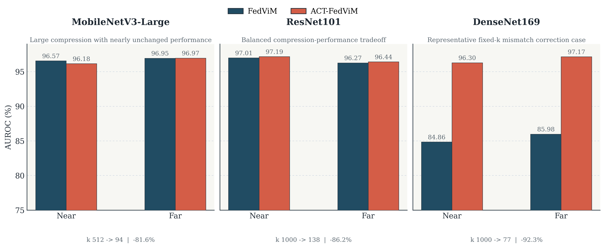

# FedViM：面向多中心海洋浮游生物监测的联邦分布外检测方法研究

## 摘要

海洋浮游生物监测正在从实验室条件下的封闭集图像分类，逐步走向多中心协作、长期连续采样和开放环境部署的真实业务场景。在这一场景中，监测系统不仅需要识别训练阶段定义的已知浮游生物类别，还需要拒识未见物种、鱼卵、鱼尾、气泡和颗粒等非目标样本，即分布外（Out-of-Distribution, OOD）样本。然而，海洋监测数据通常由不同海域、平台或单位分别采集和维护，原始图像及其采样元信息往往关联采样位置、时间、设备和任务背景等敏感内容，因而难以直接集中共享。由此，海洋浮游生物 OOD 检测面临着“开放环境识别需求”与“多中心数据不能汇聚”的双重约束。

针对上述问题，本文提出 `FedViM`，一种面向多中心海洋浮游生物监测的联邦后处理 OOD 检测方法。该方法不要求服务器访问原始图像或逐样本特征，而是由各客户端在本地 ID 训练集上计算一阶与二阶特征充分统计量，服务器据此重构 ViM（Virtual-logit Matching）所需的全局特征均值与协方差，并进一步聚合经验校准系数 `alpha`，从而在联邦场景下复现 ViM 的核心打分过程。在此基础上，本文进一步提出 `ACT-FedViM` 作为 `FedViM` 的扩展方法，引入 ACT（Adjusted Correlation Thresholding）机制自适应选择主子空间维度 `k`，以替代原始 ViM 中依赖经验设定的 fixed-k 方案。

本文在 `DYB-PlanktonNet` 构建的海洋浮游生物 OOD 划分上，对 `5` 个由 `FedAvg` 训练得到的 CNN 模型进行了系统评估。实验表明：在与通用联邦 OOD 基线 `FedLN` 和 `FOSTER` 的比较中，`FedViM` 的平均 Near-OOD / Far-OOD AUROC 分别达到 `94.12%` 和 `94.39%`，`ACT-FedViM` 进一步达到 `96.37%` 和 `96.60%`；在与 `Pooled-ViM` 和 `Pooled-ACT-ViM` 的比较中，联邦版本与 pooled 版本的平均差值均接近于 `0`，说明联邦统计量聚合没有实质破坏 ViM 的判别行为；作为辅助消融，`FedViM` 与 `ACT-FedViM` 相比 `MSP` 与 `Energy` 也表现出更强的检测能力。与此同时，`ACT-FedViM` 将平均主子空间维度由 `804.8` 压缩到 `103`，平均压缩率达到 `86.75%`。这些结果说明，`FedViM` 为多中心海洋浮游生物监测提供了一条可实现的联邦 ViM 迁移路线，而 `ACT-FedViM` 则进一步增强了该路线的紧凑性与跨 backbone 适配性。

**关键词**：联邦学习；分布外检测；ViM；ACT；海洋浮游生物；图像识别

## Abstract

Marine plankton monitoring is moving from closed-set image classification in laboratory settings toward real-world deployment with multi-center collaboration, long-term acquisition, and open-environment uncertainty. In such settings, a monitoring system must not only classify known plankton categories defined during training, but also reject unseen species and non-target samples such as fish eggs, fish tails, bubbles, and particles, namely out-of-distribution (OOD) samples. Meanwhile, plankton data are often collected and maintained by different institutes or observation centers. Raw images and their sampling metadata may reveal sensitive information about regions, timestamps, devices, and mission context, making direct centralized pooling impractical. As a result, marine plankton OOD detection faces a dual constraint: open-world recognition is necessary, while cross-center raw-data sharing is restricted.

To address this problem, this thesis proposes **FedViM**, a federated post-hoc OOD detection method for multi-center marine plankton monitoring. The method does not require the server to access raw images or sample-level features. Instead, each client computes first- and second-order feature sufficient statistics on its local ID training split, and the server reconstructs the global feature mean and covariance required by **ViM** (Virtual-logit Matching). It also aggregates empirical statistics for the calibration coefficient `alpha`, thereby reproducing the core ViM scoring pipeline in a federated manner. On top of this main method, this thesis further proposes **ACT-FedViM** as an extension of **FedViM**, introducing **ACT** (Adjusted Correlation Thresholding) to adaptively determine the principal subspace dimension `k` rather than relying on the fixed-k heuristic used in the original ViM.

Experiments are conducted on an OOD split derived from **DYB-PlanktonNet**, using five CNN backbones trained with **FedAvg**. Results show that, against generic federated OOD baselines, **FedViM** achieves average Near-OOD / Far-OOD AUROC of `94.12%` and `94.39%`, while **ACT-FedViM** further reaches `96.37%` and `96.60%`. In comparisons with **Pooled-ViM** and **Pooled-ACT-ViM**, the average difference between federated and pooled variants is nearly zero, indicating that federated statistic aggregation does not materially alter ViM behavior. As an auxiliary score ablation, **FedViM** and **ACT-FedViM** also outperform **MSP** and **Energy** on this task. In addition, **ACT-FedViM** reduces the average principal subspace dimension from `804.8` to `103`, corresponding to an average compression rate of `86.75%`. These findings suggest that **FedViM** provides a practical route for migrating ViM to federated multi-center plankton monitoring, and **ACT-FedViM** further improves compactness and backbone adaptability.

**Keywords**: federated learning; out-of-distribution detection; ViM; ACT; marine plankton; image recognition

## 第1章 绪论

### 1.1 研究背景

浮游生物是海洋生态系统的重要基础组成部分，其丰度、群落结构及其时空变化与海洋食物网、营养盐循环和生态环境预警密切相关[1]。随着显微成像、流式成像和原位成像平台的发展，海洋浮游生物监测已经从低通量人工镜检逐步转向高通量图像分析与智能识别[2-4]。在这一过程中，深度学习模型显著提升了已知类别上的分类精度，使自动化浮游生物识别成为可能。

但真实业务场景中的海洋浮游生物监测并不是一个理想化的封闭集分类任务。监测系统面向的是开放海洋环境，测试阶段不可避免地出现训练集中从未定义的样本，包括未见浮游生物物种、形态相似但未被纳入当前任务标签体系的近域未知类，以及鱼卵、鱼尾、气泡、颗粒等明显非目标样本[5-7]。如果系统仅依据 closed-set 分类器输出最终结果，那么它往往会对这些 OOD 样本给出高置信度误判，从而影响监测结果的可靠性、后续人工复核成本和下游生态分析质量。因此，在海洋浮游生物监测中，仅仅提高已知类准确率并不足以满足部署需求，模型还必须具备对未知类别和非目标样本的拒识能力。

换言之，海洋浮游生物图像识别首先是一个 OOD 检测问题。与自然图像中的粗粒度类别不同，浮游生物任务常常具有细粒度、形态差异微弱和类别边界模糊等特点。尤其在 Near-OOD 情形下，未知样本与已知类别可能共享局部形态结构，导致仅依赖输出层置信度的简单阈值法难以稳定区分 ID 与 OOD[7]。因此，需要研究更适合该任务特征空间结构的 OOD 打分方法，并使其能够在真实海洋监测系统中落地。

然而，仅从 OOD 需求出发仍然不足以构成本文的完整问题设定。真实海洋监测数据往往由不同海域、平台或单位分别采集和维护，各中心在采样环境、成像设备、类别分布与标注进度上存在明显差异。更重要的是，原始图像及其采样元信息可能关联采样位置、时间、设备和任务背景等敏感内容，因此很难简单汇聚到中心服务器进行统一训练和统一统计。也就是说，在多中心海洋浮游生物监测场景下，OOD 检测并不是在一个集中式数据池上完成的，而是在“原始数据不能跨中心共享”的约束下完成的。

联邦学习（Federated Learning, FL）通过“数据留在本地、模型更新在中心聚合”的机制，为这一约束提供了基本解决框架[8-10]。但现有联邦学习研究主要聚焦于已知类别上的分类训练，而真实部署中的 OOD 风险并不会因为采用了联邦训练而自然消失。于是，本文真正关注的问题是：**在原始图像不能直接汇聚的多中心海洋浮游生物监测场景下，如何为已经训练好的联邦分类模型补上一条可实现、可复用、部署成本较低的 OOD 检测路径。**

在这一问题上，后处理式 OOD 检测具有较强吸引力。相比重新设计复杂训练框架或引入额外生成模型，后处理方法能够直接作用于已经训练完成的分类器，具有实现简单、迁移方便和部署成本较低等优势[11-13]。Han 等在海洋浮游生物 OOD benchmark 上的系统比较进一步表明，ViM 在该任务上具有较强竞争力，尤其在 Far-OOD 场景中表现突出[7]。基于此，本文选择以 ViM 为主线，研究其在联邦场景中的可迁移性，并进一步讨论主子空间维度自适应选择问题。

### 1.2 国内外研究现状

**（1）海洋浮游生物开放环境识别研究。**  
当前海洋浮游生物图像识别研究已经从单纯追求 closed-set 分类准确率，逐步转向更接近真实部署条件的鲁棒识别问题。Eerola 等[2] 总结了自动化浮游生物图像识别面临的主要挑战，指出开放环境、采样条件变化和数据分布偏移是该领域的重要难点。Schmid 等[4] 和 Pitois 等[3] 则从海上边缘部署和实时监测角度进一步说明，实际监测系统需要面对持续变化的采样环境和更高的自动化要求。在此基础上，Chen 等[5] 从 dataset shift 角度分析了浮游生物识别模型在跨数据分布条件下的鲁棒性问题，Kareinen 等[6] 直接面向 open-set plankton recognition 研究了未知类拒识需求。Han 等[7] 更进一步，在海洋浮游生物 OOD benchmark 上系统比较了 `22` 种先进方法，明确展示了该任务中 Near-OOD 与 Far-OOD 的差异特征，并为后续方法选择提供了直接依据。总体来看，海洋浮游生物领域已经清楚意识到：真实监测并不止于分类，还需要能够识别未知样本。

**（2）通用 OOD 检测研究。**  
通用视觉领域的 OOD 检测研究大体可分为训练期方法与后处理方法两类。训练期方法通常需要在训练阶段引入额外外类数据、对抗目标或生成模型，方法设计复杂但可针对性塑造决策边界；后处理方法则直接作用于已训练分类器，具有更好的可迁移性和工程适配性。后处理路线中，`MSP`[11] 使用最大 softmax 概率刻画模型置信度，是最经典的输出空间基线；`Energy`[12] 使用 log-sum-exp 构造能量分数，在多个视觉任务上表现出优于 `MSP` 的稳定性；`ViM`[13] 则同时利用 logits 与特征空间几何结构，通过主子空间与残差空间分解来刻画样本偏离 ID 分布的程度。相比纯输出空间方法，ViM 能够利用中间特征统计结构，这一点对细粒度浮游生物任务尤为重要。Han 等的结果也表明，ViM 在 plankton OOD task 上表现突出，这成为本文选择 ViM 而非从头比较所有 score 的直接任务动机[7]。

**（3）联邦场景 OOD 检测研究。**  
联邦学习方面，FedAvg 建立了最经典的参数平均框架[8]，随后 Kairouz 等[9] 和 Yang 等[10] 从系统、通信、隐私和非 IID 挑战等方面进行了系统综述。与之相比，联邦场景下的 OOD 检测研究仍相对有限。现有工作往往更强调训练期耦合，例如 `FOSTER` 通过额外的外类特征生成与正则化机制提升联邦 OOD 检测能力[15]；而在本文实验中引入的 `FedLN`，则是基于 `LogitNorm`[16] 构造的 thesis-oriented 联邦输出空间基线。这类方法为联邦 OOD 提供了可比较对象，但它们要么依赖训练期额外模块，要么仍然主要停留在输出空间置信度层面。与这些方法相比，本文更关注另一条路径：在已经训练好的联邦分类器上，能否通过聚合充分统计量来迁移 ViM，从而在不共享原始图像的条件下保留更丰富的特征空间信息。

综上，现有研究已经分别回答了三个相邻但尚未打通的问题：海洋浮游生物识别确实存在开放环境 OOD 风险[5-7]；联邦学习可以解决多中心数据不能直接汇聚的问题[8-10]；ViM 是适合该任务的有竞争力后处理 score[7][13]。但仍缺少一种方法，能够把这三者真正串联起来，使 ViM 在联邦场景下可实现、可部署，并进一步对其主子空间维度进行统计驱动的自适应选择。本文正是在这一缺口上展开研究。

### 1.3 本文主要工作

围绕“多中心海洋浮游生物监测中的联邦后处理 OOD 检测”这一问题，本文的主要工作如下：

1. 提出 `FedViM`。本文将 ViM 所需的全局统计量改写为联邦充分统计量聚合过程，各客户端只上传本地一阶与二阶特征统计量以及经验校准所需标量统计量，服务器即可重构全局特征均值、协方差和经验 `alpha`，从而在不共享原始图像与逐样本特征的前提下实现 ViM 迁移。
2. 提出 `ACT-FedViM` 作为 `FedViM` 的扩展。该方法在相同联邦统计量管线上引入 ACT，仅对主子空间维度 `k` 的选择方式进行替换，不改变 ViM 主方向来源，使主子空间构造从 fixed-k 经验设定转为统计驱动的自适应选维。
3. 构建两条实验论证链。第一条证据链通过 `FedViM / ACT-FedViM` 与通用联邦 OOD 基线 `FedLN / FOSTER` 的比较，验证联邦 ViM 路线的有效性；第二条证据链通过 `FedViM ≈ Pooled-ViM` 与 `ACT-FedViM ≈ Pooled-ACT-ViM` 的比较，验证联邦聚合没有实质破坏 ViM 所需统计量。
4. 给出 ViM 选择合理性与 ACT 模块作用的补充分析。本文不把 `MSP / Energy` 作为主结果基线，而是将其作为 score 选择的辅助消融，说明在当前 plankton task 上 ViM 路线比常见输出空间 score 更合适；同时通过代表模型分析说明，ACT 的主要价值在于自适应选维和压缩，并非在所有 backbone 上都必然带来 AUROC 提升。

### 1.4 论文结构安排

全文共分为六章，各章内容安排如下。

第 1 章为绪论，介绍研究背景、国内外研究现状、本文主要工作与论文结构安排。  
第 2 章为预备知识，给出 OOD 检测问题、ViM、联邦学习与 ACT 的基础定义和数学工具。  
第 3 章为研究设计，详细说明 `FedViM` 与 `ACT-FedViM` 的构造方式，并分析方法性质、复杂度与部署特征。  
第 4 章为实验设计，介绍数据集、OOD 划分、联邦实验设定、对比方法和评价指标。  
第 5 章为实验结果与分析，按照“主比较”“合理性验证”和“ACT 模块分析”三条线索展开讨论。  
第 6 章为结论与展望，总结全文工作并讨论局限性与未来研究方向。

## 第2章 预备知识

### 2.1 OOD 检测问题

设输入空间为 $\mathcal{X}$，标签空间为 $\mathcal{Y}=\{1,\dots,C\}$。训练阶段可见的已知类别样本服从分布 $P_{\text{ID}}(x,y)$，测试阶段还可能出现来自未知类别或非目标样本的分布 $P_{\text{OOD}}(x)$。对于一个分类模型 $f_\theta:\mathcal{X}\rightarrow\mathbb{R}^C$，closed-set 分类只关注

$$
\hat{y}(x)=\arg\max_{c\in\mathcal{Y}} f_\theta(x)_c,
$$

而 OOD 检测还需要额外定义一个分数函数 $s(x)$，用来衡量样本与 ID 分布的一致程度。给定阈值 $\tau$，一个常见判别规则可以写为

$$
\text{Decision}(x)=
\begin{cases}
\text{ID}, & s(x)\ge \tau,\\
\text{OOD}, & s(x)< \tau.
\end{cases}
$$

其中，阈值方向取决于具体 score 的定义。对本文采用的 ViM 系 score 而言，分数越低通常表示样本越偏离 ID 分布。

在本文任务中，OOD 检测进一步区分为两类：一类是与训练类别形态相近的 Near-OOD，另一类是鱼卵、鱼尾、气泡、颗粒等明显非目标样本构成的 Far-OOD。前者更接近开放世界中的“未知相似类”，后者更接近监测系统运行中常见的“非目标干扰样本”。这一划分使我们可以分别分析方法在细粒度未知类与明显外类两种场景下的表现。

从评价角度看，OOD 检测通常不依赖单一阈值，而使用阈值无关指标衡量 score 排序能力。本文正文主要报告 AUROC，它衡量样本分数在所有阈值上的整体可分性。与此同时，结构化结果文件中也保留了 AUPR 与 FPR95，用于补充分析。除此之外，本文还关注联邦分类模型在 `D_ID_test` 上的 Accuracy，以确保 OOD 结果建立在合理的已知类识别能力之上。

### 2.2 ViM 方法

ViM（Virtual-logit Matching）是一类利用特征空间几何结构的后处理 OOD 检测方法[13]。设分类器由特征提取器与线性分类头组成。对于输入样本 $x$，记其倒数第二层特征为

$$
z=f_\theta(x)\in\mathbb{R}^D,
$$

分类头输出 logits 为

$$
g_\theta(x)=Wz+b\in\mathbb{R}^C.
$$

ViM 的核心思想是：ID 样本往往集中分布在由全局特征统计量诱导出的主子空间附近，而 OOD 样本更可能在残差空间中产生较大的偏离。为此，ViM 首先基于 ID 训练样本估计特征均值 $\mu$ 和协方差 $\Sigma$，再对协方差进行主成分分析，选取前 $k$ 个主方向构成主子空间矩阵

$$
P\in\mathbb{R}^{D\times k}.
$$

于是，样本在残差空间中的偏离可以表示为

$$
R(x)=\left\|(I-PP^\top)(z-\mu)\right\|_2.
$$

与仅依赖 softmax 置信度的方法不同，ViM 并不把输出层和特征层分开看待，而是将残差项与 logits 能量项结合起来。本文沿用的打分形式可写为

$$
E(x)=\log\sum_{c=1}^C \exp(g_\theta(x)_c),
$$

$$
S_{\text{ViM}}(x)=E(x)-\alpha R(x),
$$

其中 $\alpha$ 为经验校准系数，用于平衡能量项与残差项的量纲差异。分数越低，样本越可能为 OOD。

ViM 的一个关键经验设定在于主子空间维度 $k$ 的选择。原始方法通常采用 fixed-k heuristic，例如在高维特征下直接取较大的常数维度[13]。这一设定实现简单，但它隐含地假设不同 backbone 的有效维度结构相近。在海洋浮游生物任务中，不同 CNN 的特征维度和谱结构差异明显，固定维度方案可能导致主子空间过大或过小，进而影响残差空间的判别能力。这一问题构成了本文引入 ACT 的直接动机。

### 2.3 联邦学习方法

联邦学习关注多个数据中心在不共享原始数据的条件下协同训练模型[8-10]。设共有 $N$ 个客户端，第 $i$ 个客户端持有本地数据集 $\mathcal{D}_i$，样本数为 $n_i$。在标准 FedAvg 框架中，服务器在第 $t$ 轮通信时向客户端下发全局模型参数 $\theta_t$，客户端在本地执行若干步更新后得到 $\theta_t^{(i)}$，服务器再按样本量加权聚合：

$$
\theta_{t+1}=\sum_{i=1}^{N}\frac{n_i}{\sum_{j=1}^{N} n_j}\theta_t^{(i)}.
$$

FedAvg 主要解决的是分类模型训练问题，即在不访问原始数据的前提下获得一个可用的全局分类器。但 OOD 检测尤其是 ViM 这类特征统计驱动的方法，还需要服务器访问全局特征均值、协方差与经验校准项，而这些量并不能从最终模型参数中直接读出。

不过，ViM 所依赖的若干量具有“充分统计量可线性聚合”的特点。若本地样本特征为 $\{z_j^{(i)}\}_{j=1}^{n_i}$，则一阶和二阶统计量

$$
\sum_{j=1}^{n_i} z_j^{(i)}, \qquad \sum_{j=1}^{n_i} z_j^{(i)}(z_j^{(i)})^\top
$$

都可以在客户端本地计算，并在服务器端线性求和。这一性质意味着：尽管 ViM 不能直接在联邦学习训练过程中“自然得到”，但它所需要的统计量并不一定要求访问逐样本特征。只要这些统计量在联邦场景下可以无损或近似无损重构，就有可能在训练结束后以 post-hoc 的方式把 ViM 迁移到联邦场景中。

### 2.4 ACT 自适应选维方法

ACT（Adjusted Correlation Thresholding）是高维统计中用于估计有效因子数的一类方法[14]。其基本思想是：直接使用样本协方差或相关矩阵的原始特征值时，高维噪声会导致特征值膨胀，从而使“有效维度”的判断偏向过大。ACT 则通过对相关矩阵谱进行修正，并与理论阈值比较，从而估计更合理的有效维度数量。

设特征协方差矩阵为 $\Sigma$，由其对角元素构成对角矩阵 $D_\Sigma$，则相关矩阵可写为

$$
R=D_\Sigma^{-1/2}\Sigma D_\Sigma^{-1/2}.
$$

记 $R$ 的降序特征值为

$$
\lambda_1\ge \lambda_2\ge \cdots \ge \lambda_p,
$$

其中 $p$ 为特征维度。ACT 对这些样本特征值进行偏差修正，得到修正特征值 $\lambda_1^C,\dots,\lambda_p^C$，并设置阈值

$$
s=1+\sqrt{\frac{p}{n-1}},
$$

其中 $n$ 为样本数。最终，有效维度估计为

$$
k_{\text{ACT}}=\max\{j:\lambda_j^C>s\}.
$$

对本文而言，ACT 的价值不在于改变 ViM 主方向的来源，而在于为主子空间维度 `k` 提供统计驱动的选择依据。换言之，ACT 解决的是“应该保留多少个主方向”，而不是“主方向本身如何定义”。这一点使得 ACT 可以自然嵌入 ViM 的联邦统计量管线：协方差仍由联邦聚合重构，PCA 仍在重构后的协方差上进行，只是主子空间的截断位置由 fixed-k 改为 $k_{\text{ACT}}$。

## 第3章 研究设计

### 3.1 问题设定与整体框架

设共有 $N$ 个客户端，每个客户端对应一个本地数据中心或监测单位。客户端 $i$ 持有本地有标签 ID 训练集

$$
\mathcal{D}_i=\{(x_j^{(i)},y_j^{(i)})\}_{j=1}^{n_i},
$$

其中 $x_j^{(i)}$ 为浮游生物图像，$y_j^{(i)}$ 为对应 ID 标签。各客户端之间不共享原始图像。训练阶段采用 FedAvg 得到全局分类模型；OOD 检测阶段固定该分类模型参数，不再进行梯度更新，而是在本地客户端上提取 ID 训练样本特征并上传统计量，由服务器构造后处理 OOD 检测器。

本文方法的整体流程如图 3-1 所示。其核心思路并不是重新设计一个训练期与 OOD 紧耦合的联邦框架，而是在训练完成之后，对 ViM 所需的统计量进行联邦化重构。`FedViM` 是主方法，负责回答“ViM 能否在联邦场景下复现”；`ACT-FedViM` 则是建立在 `FedViM` 之上的选维扩展，负责回答“在已经可联邦化的 ViM 上，fixed-k 是否可以被统计驱动的自适应选维替代”。

*图 3-1 `FedViM` 与 `ACT-FedViM` 的联邦后处理流程图。*

从实现上看，整条管线可以分为三个阶段：

1. 联邦分类训练阶段：使用 FedAvg 训练 backbone，并仅以服务端验证集准确率选择 `best_model`。
2. 联邦统计量重构阶段：固定 `best_model`，由各客户端计算本地 ID 训练分片上的充分统计量，服务器重构全局特征均值、协方差与经验 `alpha`。
3. OOD 打分阶段：在重构得到的统计量基础上，对 `D_ID_test`、`D_Near_test` 与 `D_Far_test` 中的样本计算 ViM 系分数，完成 OOD 评估。

### 3.2 FedViM：联邦统计量重构与 ViM 迁移

#### 3.2.1 联邦一阶与二阶统计量重构

给定冻结的特征提取器 $f_\theta$，客户端 $i$ 在本地 ID 训练集上计算如下充分统计量：

$$
\begin{aligned}
s_i^{(1)} &= \sum_{x\in \mathcal{D}_i} f_\theta(x),\\
s_i^{(2)} &= \sum_{x\in \mathcal{D}_i} f_\theta(x)f_\theta(x)^\top,\\
n_i &= |\mathcal{D}_i|.
\end{aligned}
$$

服务器对各客户端上传结果进行聚合，得到

$$
\begin{aligned}
S^{(1)} &= \sum_{i=1}^{N} s_i^{(1)},\\
S^{(2)} &= \sum_{i=1}^{N} s_i^{(2)},\\
n &= \sum_{i=1}^{N} n_i.
\end{aligned}
$$

于是，全局特征均值可以写为

$$
\mu_{\text{global}}=\frac{S^{(1)}}{n}.
$$

全局二阶矩为

$$
\mathbb{E}[zz^\top]\approx\frac{S^{(2)}}{n},
$$

从而全局协方差可重构为

$$
\Sigma_{\text{global}}=\frac{S^{(2)}}{n}-\mu_{\text{global}}\mu_{\text{global}}^\top.
$$

上述推导表明，ViM 所需要的核心统计量 $\mu$ 与 $\Sigma$ 可以通过联邦聚合充分统计量直接重构，而不需要服务器访问原始图像或逐样本特征。也就是说，ViM 的“全局特征统计依赖”并不必然与联邦约束冲突；只要客户端能够上传可聚合的一阶与二阶量，服务器就能够在后处理阶段复现 ViM 所需的统计基础。

#### 3.2.2 主子空间构造与 fixed-k FedViM

在 `FedViM` 中，服务器基于 $\Sigma_{\text{global}}$ 进行特征分解，并按 fixed-k heuristic 截取前 $k$ 个主方向构造主子空间矩阵

$$
P\in\mathbb{R}^{D\times k}.
$$

在本文五个 backbone 的正式实验中，`feature_dim > 1500` 的模型使用 `k=1000`，其余模型使用 `k=512`。这一设定与原始 ViM 的经验性 fixed-k 口径保持一致，因而 `FedViM` 的意义在于：在不改变 ViM 主体定义的前提下，将其所需统计量迁移到联邦场景中。

给定测试样本 $x$，记其特征为 $z=f_\theta(x)$，则残差项为

$$
R(x)=\left\|(I-PP^\top)(z-\mu_{\text{global}})\right\|_2.
$$

能量项为

$$
E(x)=\log\sum_{c=1}^{C}\exp(g_\theta(x)_c).
$$

此时只差经验 `alpha` 尚未估计完成。

#### 3.2.3 联邦经验 alpha 校准

为了平衡残差项与能量项的量纲，本文采用与 ViM 一致的经验校准思想，用 ID 训练样本上的平均能量与平均残差之比来估计 `alpha`：

$$
\alpha=\frac{\mathbb{E}_{\text{ID}}[E(x)]}{\mathbb{E}_{\text{ID}}[R(x)]}.
$$

当 $\mu_{\text{global}}$ 与 $P$ 固定后，客户端 $i$ 可在本地 ID 训练集上进一步计算

$$
S_i^{E}=\sum_{x\in\mathcal{D}_i} E(x),\qquad
S_i^{R}=\sum_{x\in\mathcal{D}_i} R(x),\qquad
n_i=|\mathcal{D}_i|.
$$

服务器聚合得到

$$
S^{E}=\sum_{i=1}^{N}S_i^{E},\qquad
S^{R}=\sum_{i=1}^{N}S_i^{R},\qquad
n=\sum_{i=1}^{N}n_i.
$$

于是，

$$
\mathbb{E}_{\text{ID}}[E(x)]\approx\frac{S^{E}}{n},\qquad
\mathbb{E}_{\text{ID}}[R(x)]\approx\frac{S^{R}}{n},
$$

从而有

$$
\alpha=\frac{S^{E}/n}{S^{R}/n}.
$$

最终，`FedViM` 的 OOD 分数写为

$$
S_{\text{FedViM}}(x)=E(x)-\alpha R(x).
$$

这说明除了协方差与均值之外，ViM 的经验校准也可以通过联邦聚合实现。由此，`FedViM` 完整回答了本文的第一个核心问题：**ViM 不仅在统计量层面可联邦化，而且其经验 alpha 也可以在不共享原始图像和逐样本特征的条件下完成估计。**

### 3.3 ACT-FedViM：基于 ACT 的自适应选维

`ACT-FedViM` 复用 `FedViM` 的全部联邦统计量管线，不额外引入新的训练阶段，也不改变协方差主方向的来源。它与 `FedViM` 的唯一差异在于：不再用 fixed-k 经验规则截断主子空间，而是根据联邦重构得到的协方差矩阵自适应估计有效维度。

具体地，首先由重构得到的全局协方差矩阵构造相关矩阵

$$
R=D_\Sigma^{-1/2}\Sigma_{\text{global}}D_\Sigma^{-1/2},
$$

其中 $D_\Sigma$ 为由 $\Sigma_{\text{global}}$ 对角元素构成的对角矩阵。记 $R$ 的特征值为 $\lambda_1,\dots,\lambda_p$，并按 ACT 规则计算修正特征值 $\lambda_1^C,\dots,\lambda_p^C$ 与阈值

$$
s=1+\sqrt{\frac{p}{n-1}}.
$$

随后，利用

$$
k_{\text{ACT}}=\max\{j:\lambda_j^C>s\}
$$

确定自适应主子空间维度。需要强调的是，ACT 在这里不改变主方向本身的来源；在获得 $k_{\text{ACT}}$ 之后，服务器仍然是在 $\Sigma_{\text{global}}$ 上做 PCA，并保留前 $k_{\text{ACT}}$ 个协方差主方向构造

$$
P_{\text{ACT}}\in\mathbb{R}^{D\times k_{\text{ACT}}}.
$$

此后，`ACT-FedViM` 的残差计算、经验 `alpha` 聚合与最终 OOD 打分都与 `FedViM` 完全一致。因而，`ACT-FedViM` 不是一个新的联邦训练框架，而是 `FedViM` 的后处理自适应选维扩展：

$$
S_{\text{ACT-FedViM}}(x)=E(x)-\alpha_{\text{ACT}}R_{\text{ACT}}(x).
$$

这一设计使得我们能够把 ACT 的作用边界严格限定在“选择多少个主方向”上，从而单独评估它对 OOD 性能和部署成本的影响。

### 3.4 方法性质分析

本文方法的性质可从合理性、复杂度与部署收益三个方面进行概括。

1. **合理性：联邦聚合可近似无损复现 ViM 所需统计量。**  
   `FedViM` 依赖的全局均值、协方差和经验 `alpha` 都是由客户端局部统计量线性聚合得到的。因此，在相同样本范围和相同冻结 backbone 下，只要数值实现一致，联邦方式与 pooled 方式在理论上应给出相同或近乎相同的统计结果。后续实验中 `FedViM ≈ Pooled-ViM`、`ACT-FedViM ≈ Pooled-ACT-ViM` 的现象，正是这一点的直接实证支持。
2. **复杂度：推理复杂度主要受 $O(Dk)$ 控制。**  
   设特征维度为 $D$，主子空间维度为 $k$。在后处理阶段，需要存储主子空间矩阵 $P\in\mathbb{R}^{D\times k}$，并在打分时完成投影与残差计算，因此额外存储与计算复杂度主要与 $Dk$ 成正比。相较于重新训练大型外类生成器或引入复杂双模型结构，这一路线更接近“在现有分类器上附加一个轻量后处理模块”的工程形态。
3. **ACT 的主要收益是压缩与适配，而非必然提升 AUROC。**  
   在五个正式 backbone 上，`ACT-FedViM` 的平均主子空间维度由 `804.8` 压缩到 `103`，平均压缩率为 `86.75%`。这意味着 ACT 在部署层面显著降低了存储和推理成本。与此同时，ACT 对 AUROC 的影响具有模型依赖性：在 `densenet169` 上它修复了明显的 fixed-k mismatch，而在 `mobilenetv3_large` 与 `efficientnet_v2_s` 上则主要表现为“大幅压缩下性能近似持平”。因此，本文将 ACT 定位为联邦 ViM 的扩展模块，而不是比 `FedViM` 更高一级的主贡献。

## 第4章 实验设计

### 4.1 数据集与 OOD 划分

本文实验基于 `DYB-PlanktonNet` 数据集[17] 构建海洋浮游生物 OOD 检测任务。结合 Han 等的划分思路[7]，本文将数据组织为以下四部分：

- `D_ID_train`：`54` 个 ID 类别，共 `26034` 张图像；
- `D_ID_test`：`54` 个 ID 类别，共 `2939` 张图像；
- `D_Near_test`：`26` 个 Near-OOD 类别，共 `1516` 张图像；
- `D_Far_test`：`12` 个 Far-OOD 类别，共 `17031` 张图像。

其中，`D_ID_train` 用于联邦训练与后处理统计量估计，`D_ID_test` 用于评估已知类分类准确率，`D_Near_test` 与 `D_Far_test` 分别用于评估 Near-OOD 与 Far-OOD 的拒识能力。Near-OOD 由与 ID 类别形态或生态属性较为接近、但不属于当前训练目标的浮游生物类别构成；Far-OOD 则主要包含鱼卵、鱼尾、气泡和颗粒等明显非目标样本，更贴近真实海洋监测中的干扰场景。

为避免训练与评估之间的数据泄漏，正式实验从 `D_ID_train` 中固定划出 `10%` 样本作为服务端验证集，即 `2603` 张图像，其余 `23431` 张图像用于联邦训练和后处理统计量估计。该设置使得 `best_model` 的选择完全基于验证准确率，不使用任何 OOD 测试集信息。

*图 4-1 正式实验中 ID、Near-OOD 与 Far-OOD 三类样本的代表性图像示例。*

图 4-1 给出了三类样本的代表性图像。可以看到，Near-OOD 中包含若干在局部形态上与 ID 类别相近的样本，而 Far-OOD 则主要由鱼卵、鱼尾、气泡和颗粒等明显非目标样本构成。这一视觉差异也解释了为何本文需要同时报告 Near-OOD 与 Far-OOD 两类结果：前者更能体现细粒度未知类的识别难度，后者更贴近实际监测系统对非目标干扰的拒识需求。

### 4.2 联邦实验设定

为模拟多中心海洋监测场景，本文使用固定的 canonical split 文件将 `23431` 个 ID 训练样本划分到 `5` 个客户端，Dirichlet 参数设为 `alpha=0.1`，随机种子为 `42`。当前正式划分下，各客户端样本量分别为 `6360`、`2513`、`3942`、`6754` 和 `3862`，体现出较明显的非 IID 与样本量不平衡特征。这一设定可以近似对应多个监测中心在采样规模、类别构成和业务覆盖范围上的差异。

分类模型训练统一采用 `FedAvg`。正式实验配置固定为：

- `n_clients = 5`
- `Dirichlet alpha = 0.1`
- `partition_seed = 42`
- `image_size = 320`
- `batch_size = 32`
- `communication_rounds = 50`
- `local_epochs = 4`

五个正式 backbone 为 `resnet101`、`efficientnet_v2_s`、`mobilenetv3_large`、`densenet169` 和 `resnet50`。这些 backbone 的作用是验证方法在不同 CNN 架构上的适配性，而不是比较“哪一个 backbone 更好”，因此 backbone 选择不作为本文主实验问题展开讨论。

在后处理阶段，所有方法均基于同一个冻结的 `best_model` 进行评估，不再进行任何参数更新。这样设计的目的是把讨论焦点放在 OOD score 与统计量获得方式上，而不是重新引入训练阶段差异。

### 4.3 对比方法

本文的比较对象按职责分为三组。

**（1）主比较：通用联邦 OOD 基线。**  
这一组用于回答“联邦 ViM 路线是否优于现有通用联邦 OOD 基线”。

- `FedViM`：本文主方法，使用联邦统计量重构得到 fixed-k ViM。
- `ACT-FedViM`：本文扩展方法，在相同联邦统计量基础上使用 ACT 自适应选择维度。
- `FedLN`：基于 `LogitNorm`[16] 构造的 thesis-oriented 联邦输出空间基线，并以 `MSP` 进行 OOD 打分。
- `FOSTER`：训练期耦合的联邦 OOD 基线[15]，本文使用仓库中统一协议下的独立适配实现，并报告 `msp` 评分结果。

**（2）合理性验证：pooled controls。**  
这一组用于回答“联邦统计量聚合是否改变了 ViM 本身的判别行为”。

- `Pooled-ViM`：在与联邦版本完全相同的冻结 `best_model` 上，直接汇聚五个客户端的 ID 训练分片，并集中计算 ViM 所需统计量。
- `Pooled-ACT-ViM`：与 `ACT-FedViM` 对应的 pooled 版本。

主比较与 pooled control 的区别在于：前者比较的是“方法优越性”，后者比较的是“联邦化实现合理性”。

**（3）辅助消融：score 选择分析。**  
这一组不参与主结果优越性结论，只用于补充说明“为何本文选择 ViM 路线而不是常见输出空间 score”。

- `MSP`
- `Energy`

这两类方法与主方法使用同一冻结 backbone，仅在分数函数上不同，因此可作为 score 选择的辅助对照。

### 4.4 评估指标

本文正文主要使用以下指标进行分析。

1. `ID Accuracy`：衡量联邦分类模型在 `D_ID_test` 上的已知类识别能力。
2. `Near-OOD AUROC`：衡量模型区分 ID 样本与 `D_Near_test` 样本的能力。
3. `Far-OOD AUROC`：衡量模型区分 ID 样本与 `D_Far_test` 样本的能力。
4. `Compression Rate`：刻画 ACT 相对于 fixed-k 在主子空间维度上的压缩效果：

$$
\text{Compression}=1-\frac{k_{\text{ACT}}}{k_{\text{fixed}}}.
$$

其中，`ID Accuracy` 保证 OOD 结果建立在合理分类器之上；Near-OOD / Far-OOD AUROC 共同刻画两类开放环境风险；`Compression Rate` 则刻画 `ACT-FedViM` 在部署紧凑性上的附加收益。AUPR 与 FPR95 也保存在结构化 JSON 中，但本文正文不将其作为主分析指标。

## 第5章 实验结果与分析

### 5.1 与现有 FL-OOD 基线的对比分析

首先比较本文方法与通用联邦 OOD 基线 `FedLN`、`FOSTER` 的整体表现。表 5-1 给出了五个 backbone 上的平均结果。

**表 5-1 与通用联邦 OOD 基线的平均比较**

| 方法 | 平均 Near-OOD AUROC (%) | 平均 Far-OOD AUROC (%) |
| --- | ---: | ---: |
| FedViM | 94.12 | 94.39 |
| ACT-FedViM | 96.37 | 96.60 |
| FedLN | 92.12 | 87.38 |
| FOSTER | 84.85 | 77.80 |

从表 5-1 可以看到，`FedViM` 与 `ACT-FedViM` 整体上都优于两类通用联邦基线。与 `FedLN` 相比，`FedViM` 在 Near-OOD 上平均高出 `2.00` 个百分点，在 Far-OOD 上高出 `7.01` 个百分点；`ACT-FedViM` 则分别高出 `4.24` 和 `9.22` 个百分点。与 `FOSTER` 相比，两条 ViM 路线的优势更为明显。这说明，对于本文关注的海洋浮游生物任务，仅依赖输出空间归一化或训练期外类正则化，并不足以稳定替代特征空间统计驱动的 ViM 路线。

*图 5-1 五个 backbone 上 `FedViM`、`ACT-FedViM`、`FedLN` 与 `FOSTER` 的 Near/Far-OOD AUROC 对比。*

进一步观察逐模型结果可以更清楚地看到差异来源。

**表 5-2 与通用联邦 OOD 基线的逐模型比较**

| 模型 | FedViM Near | ACT Near | FedLN Near | FOSTER Near | FedViM Far | ACT Far | FedLN Far | FOSTER Far |
| --- | ---: | ---: | ---: | ---: | ---: | ---: | ---: | ---: |
| mobilenetv3_large | 96.57 | 96.18 | 92.01 | 87.07 | 96.95 | 96.97 | 88.14 | 79.86 |
| resnet50 | 96.00 | 96.44 | 90.89 | 89.44 | 95.85 | 95.91 | 83.11 | 79.54 |
| resnet101 | 97.01 | 97.19 | 90.71 | 88.28 | 96.27 | 96.44 | 83.51 | 80.33 |
| densenet169 | 84.86 | 96.30 | 93.28 | 83.12 | 85.98 | 97.17 | 90.52 | 77.22 |
| efficientnet_v2_s | 96.19 | 95.72 | 93.72 | 76.34 | 96.92 | 96.50 | 91.62 | 72.05 |

表 5-2 显示，`ACT-FedViM` 在五个 backbone 上都保持了强竞争力，并在 `resnet50`、`resnet101` 和 `densenet169` 上显著领先。`FedViM` 在四个 backbone 上已经能够稳定超过 `FedLN`，只有 `densenet169` 上由于 fixed-k 与该 backbone 的谱结构不匹配，导致 Near/Far-OOD 表现偏低；这一问题在 `ACT-FedViM` 中得到了修复。需要强调的是，这个低点不是联邦统计量聚合的失败，而是 fixed-k 经验选维在特定 backbone 上的不适配。也正因为如此，本文把 `FedViM` 视为主贡献，而把 `ACT-FedViM` 视为对 fixed-k 风险的扩展修正。

在主比较之外，本文还保留了一个辅助 score 消融，用于说明 ViM 选择的合理性。这里的比较对象不是 `FedLN / FOSTER`，而是与同一冻结 backbone 配套的 `MSP / Energy`。

**表 5-3 score 选择的辅助消融结果**

| 方法 | 平均 Near-OOD AUROC (%) | 平均 Far-OOD AUROC (%) |
| --- | ---: | ---: |
| FedViM | 94.12 | 94.39 |
| ACT-FedViM | 96.37 | 96.60 |
| MSP | 86.17 | 82.53 |
| Energy | 79.79 | 77.22 |

表 5-3 表明，在当前 plankton task 上，ViM 路线明显优于常见的输出空间 score。`FedViM` 相比 `MSP` 在 Near-OOD 和 Far-OOD 上分别高出 `7.95` 和 `11.86` 个百分点；`ACT-FedViM` 的优势则进一步扩大到 `10.20` 和 `14.07` 个百分点。`Energy` 在该任务上的整体表现甚至低于 `MSP`。这与 Han 等[7] 对 plankton OOD benchmark 的观察是一致的，即 ViM 比纯输出空间 score 更适合该任务。需要指出的是，这一比较在本文中只承担“score 选择合理性”的辅助作用，而不再承担主实验基线的职责。

### 5.2 与 pooled ViM / pooled ACT-ViM 的比较

为验证联邦统计量聚合没有实质改变 ViM 的判别行为，本文进一步将 `FedViM` 与 `Pooled-ViM`、`ACT-FedViM` 与 `Pooled-ACT-ViM` 进行对照。这里所有方法都基于同一个冻结 `best_model` 和同一批 ID 训练样本，唯一差异只是统计量的获得方式：联邦版本按客户端先分片计算再聚合，pooled 版本则将这些分片直接汇总后集中计算。

**表 5-4 联邦统计量聚合与 pooled 统计的一致性验证**

| 比较组 | 联邦 Near-OOD AUROC (%) | Pooled Near-OOD AUROC (%) | 平均差值 Near (百分点) | 联邦 Far-OOD AUROC (%) | Pooled Far-OOD AUROC (%) | 平均差值 Far (百分点) |
| --- | ---: | ---: | ---: | ---: | ---: | ---: |
| FedViM vs Pooled-ViM | 94.12 | 94.12 | -0.000004 | 94.39 | 94.39 | 0.000000 |
| ACT-FedViM vs Pooled-ACT-ViM | 96.37 | 96.37 | +0.000013 | 96.60 | 96.60 | +0.000004 |

从平均结果看，`FedViM` 与 `Pooled-ViM` 的 Near/Far-OOD 平均差值分别仅为 `-0.000004` 和 `0.000000` 个百分点，`ACT-FedViM` 与 `Pooled-ACT-ViM` 的平均差值也仅为 `+0.000013` 和 `+0.000004` 个百分点。换言之，这些差异已经完全退化到数值误差量级。这一结果直接支持了第 3 章中的方法性质分析：ViM 所需统计量在联邦场景下可以近乎无损重构，联邦化实现没有破坏其核心判别行为。

*图 5-2 `Pooled - Federated` 的逐模型差值结果。横轴单位为百分点，差值越接近 `0` 表示两种统计方式越一致。*

为了进一步说明这一点，表 5-5 给出逐模型结果。

**表 5-5 pooled consistency 的逐模型结果**

| 模型 | FedViM Near | Pooled-ViM Near | Near 差值(百分点) | FedViM Far | Pooled-ViM Far | Far 差值(百分点) | ACT Near | Pooled-ACT Near | ACT Near 差值(百分点) | ACT Far | Pooled-ACT Far | ACT Far 差值(百分点) |
| --- | ---: | ---: | ---: | ---: | ---: | ---: | ---: | ---: | ---: | ---: | ---: | ---: |
| mobilenetv3_large | 96.57 | 96.57 | -0.000022 | 96.95 | 96.95 | -0.000006 | 96.18 | 96.18 | +0.000000 | 96.97 | 96.97 | -0.000004 |
| resnet50 | 96.00 | 96.00 | -0.000067 | 95.85 | 95.85 | -0.000068 | 96.44 | 96.44 | +0.000090 | 95.91 | 95.91 | -0.000002 |
| resnet101 | 97.01 | 97.01 | -0.000022 | 96.27 | 96.27 | +0.000044 | 97.19 | 97.19 | -0.000022 | 96.44 | 96.44 | +0.000030 |
| densenet169 | 84.86 | 84.86 | +0.000067 | 85.98 | 85.98 | +0.000054 | 96.30 | 96.30 | +0.000000 | 97.17 | 97.17 | -0.000004 |
| efficientnet_v2_s | 96.18 | 96.18 | +0.000022 | 96.91 | 96.91 | -0.000026 | 95.72 | 95.72 | +0.000000 | 96.50 | 96.50 | +0.000000 |

表 5-5 进一步表明，五个 backbone 上 federated 与 pooled 的结果几乎完全重合。逐模型的最大绝对差值也只有 `0.000090` 个百分点，已经处于数值误差范围内；`densenet169` 的 fixed-k `FedViM` 与 `Pooled-ViM` 同样保持一致。因此，本文可以更有把握地给出结论：**FL 没有实质破坏 ViM，`densenet169` 上的性能瓶颈来自 fixed-k 选维本身，而不是联邦统计量聚合误差。**

### 5.3 ACT 模块效果分析

ACT 的作用不是改变 ViM 的主方向来源，而是自适应决定“保留多少个主方向”。因此，本节重点分析它在压缩与适配性上的作用，而不是把它简单解读为“始终提高 AUROC 的增强模块”。

首先，从五个 backbone 的整体压缩效果看，ACT 显著缩小了主子空间规模。

*图 5-3 五个 backbone 上 fixed-k 与 ACT 选维结果的比较。*

图 5-3 对应的统计结果表明，`FedViM` 的平均 fixed-k 为 `804.8`，而 ACT 选择的平均维度仅为 `103`，平均压缩率达到 `86.75%`。这意味着在部署阶段，需要保存的投影矩阵规模以及残差打分时的额外计算量都显著下降。

为了覆盖不同 backbone 上 ACT 的三类代表性行为，本文选择 `mobilenetv3_large`、`resnet101` 和 `densenet169` 进行进一步分析。

**表 5-6 ACT 模块的代表模型分析**

| 代表模型 | 特征维度 D | fixed-k | ACT k | 压缩率 (%) | FedViM Near (%) | ACT Near (%) | FedViM Far (%) | ACT Far (%) |
| --- | ---: | ---: | ---: | ---: | ---: | ---: | ---: | ---: |
| mobilenetv3_large | 960 | 512 | 94 | 81.64 | 96.57 | 96.18 | 96.95 | 96.97 |
| resnet101 | 2048 | 1000 | 138 | 86.20 | 97.01 | 97.19 | 96.27 | 96.44 |
| densenet169 | 1664 | 1000 | 77 | 92.30 | 84.86 | 96.30 | 85.98 | 97.17 |

*图 5-4 `mobilenetv3_large`、`resnet101` 与 `densenet169` 三个代表模型上的 Near/Far-OOD AUROC 对比。*

`mobilenetv3_large` 对应“显著压缩、性能基本持平”的情形。其主子空间维度从 `512` 降至 `94`，压缩率达到 `81.64%`；Near-OOD 上仅下降 `0.39` 个百分点，Far-OOD 上则几乎不变。这说明对于轻量 backbone，ACT 的主要收益是以极小的精度代价换取更紧凑的后处理模块。

`resnet101` 对应“压缩与性能平衡”的情形。其主子空间从 `1000` 降到 `138`，压缩率为 `86.20%`，同时 Near-OOD 与 Far-OOD 都有轻微提升。这说明在高维 backbone 上，ACT 能够在显著减少子空间规模的同时保持甚至略微改善检测性能。

`densenet169` 则对应“fixed-k mismatch 修复”的情形。其主子空间从 `1000` 降到 `77`，压缩率达到 `92.30%`；Near-OOD 从 `84.86%` 跃升到 `96.30%`，Far-OOD 从 `85.98%` 跃升到 `97.17%`。这一结果说明，ACT 在该 backbone 上并不是简单地“微调一个超参数”，而是修复了 fixed-k 将主子空间设得过大、导致残差空间判别能力被削弱的问题。

与此同时，`efficientnet_v2_s` 与 `mobilenetv3_large` 上的结果也提醒我们：ACT 并不保证在所有模型上都提升 AUROC。它的稳定收益主要体现在两点：第一，以统计驱动的方式替代经验式 fixed-k；第二，在绝大多数 backbone 上显著压缩主子空间规模。因此，本文将 `ACT-FedViM` 定位为 `FedViM` 的扩展模块，而不是把它写成脱离 `FedViM` 的独立主线。

## 第6章 结论与展望

本文围绕多中心海洋浮游生物监测场景下“存在 OOD 风险但原始数据不能直接汇聚”这一核心问题，研究了联邦后处理 OOD 检测方法。全文首先从海洋浮游生物监测的开放环境需求出发，说明 closed-set 分类不足以支撑真实部署；随后结合多中心数据采集、存储和治理约束，论证了引入联邦学习框架的必要性；最后选择 ViM 作为任务相关的后处理路线，并将其迁移到联邦场景中。

本文的主要结论如下：

1. ViM 所需的全局特征均值、协方差和经验 `alpha` 都可以通过联邦充分统计量聚合进行重构，从而形成一条不依赖原始图像共享的联邦后处理 OOD 检测路线。这一结论由 `FedViM` 的方法推导和 `FedViM ≈ Pooled-ViM` 的实验结果共同支持。
2. 以 `FedLN` 和 `FOSTER` 为代表的通用联邦 OOD 基线相比，`FedViM` 与 `ACT-FedViM` 在当前 plankton task 上具有更强的整体检测能力。尤其在 Far-OOD 场景中，ViM 路线能够更稳定地利用特征空间结构信息，这说明它更适合海洋浮游生物这类细粒度开放环境识别任务。
3. `ACT-FedViM` 的主要价值在于为联邦 ViM 提供统计驱动的自适应选维机制。它在五个 backbone 上将平均主子空间维度从 `804.8` 压缩至 `103`，平均压缩率达到 `86.75%`。在部分 backbone 上，ACT 还能修复 fixed-k mismatch，但这并不意味着 ACT 在所有模型上都必然提升 AUROC。

尽管本文取得了较为清晰的结果，但仍存在以下局限。

首先，本文的方法仍以统计量级别的共享为前提，虽然避免了原始图像与逐样本特征上传，但并没有进一步引入安全聚合、差分隐私等机制来给出更强的隐私保证。未来可在联邦统计量上传阶段引入隐私增强机制，研究“可证明安全”的联邦后处理 OOD 检测。

其次，本文只在 `5` 个 CNN backbone 与当前 `DYB-PlanktonNet` 划分上验证方法，尚未覆盖更大范围的监测平台、更多中心分布与其他开放环境数据集。未来可以将本文方法迁移到更多海洋监测场景，验证其跨数据集稳定性。

最后，本文对 ViM 的改进主要集中在主子空间维度选择上，仍然沿用了“主子空间 + 残差空间”的基本几何分解方式。当判别性信息并不主要落在残差空间时，单纯改进 `k` 的估计可能仍不足以捕获所有 OOD 结构。后续可以在保持联邦统计量可聚合的前提下，进一步探索更丰富的特征空间建模方式与更稳健的后处理 score。

总体而言，本文给出的结论是明确的：`FedViM` 为多中心海洋浮游生物监测提供了一条可实现的联邦 ViM 后处理路线；`ACT-FedViM` 则在此基础上增强了方法的紧凑性与对不同 backbone 的适配能力。这为后续在海洋智能监测系统中部署联邦 OOD 检测模块提供了可复用的技术基础。

---

## 参考文献

[1] Naselli-Flores L, Padisak J. Ecosystem services provided by marine and freshwater phytoplankton[J]. Hydrobiologia, 2023, 850(12-13): 2691-2706.  
[2] Eerola T, Kareinen J, Pitois S G, et al. Survey of automatic plankton image recognition: challenges, existing solutions and future perspectives[J]. Artificial Intelligence Review, 2024, 57(5): 114.  
[3] Pitois S G, Schmid M S, Eerola T, et al. RAPID: real-time automated plankton identification dashboard using Edge AI at sea[J]. Frontiers in Marine Science, 2025, 11: 1513463.  
[4] Schmid M S, Eerola T, Pitois S G, et al. Edge computing at sea: high-throughput classification of in-situ plankton imagery for adaptive sampling[J]. Frontiers in Marine Science, 2023, 10: 1187771.  
[5] Chen C, Kyathanahally S P, Reyes M, et al. Producing plankton classifiers that are robust to dataset shift[J]. Limnology and Oceanography: Methods, 2025, 23: 39-66.  
[6] Kareinen J, Skyttä A, Eerola T, et al. Open-set plankton recognition[C]//Del Bue A, Leal-Taixe L, eds. Computer Vision - ECCV 2024 Workshops. Cham: Springer, 2025: 168-184.  
[7] Han Y, He J, Xie C, et al. Benchmarking out-of-distribution detection for plankton recognition: a systematic evaluation of advanced methods in marine ecological monitoring[C]//Proceedings of the IEEE/CVF International Conference on Computer Vision Workshops. Piscataway, NJ, USA: IEEE, 2025: 2142-2152.  
[8] McMahan B, Moore E, Ramage D, et al. Communication-efficient learning of deep networks from decentralized data[C]//Singh A, Zhu J, eds. Proceedings of the 20th International Conference on Artificial Intelligence and Statistics. Fort Lauderdale, FL, USA: PMLR, 2017: 1273-1282.  
[9] Kairouz P, McMahan H B, Avent B, et al. Advances and open problems in federated learning[J]. Foundations and Trends in Machine Learning, 2021, 14(1-2): 1-210.  
[10] Yang Q, Liu Y, Chen T, et al. Federated machine learning: Concept and applications[J]. ACM Transactions on Intelligent Systems and Technology, 2019, 10(2): 12:1-12:19.  
[11] Hendrycks D, Gimpel K. A baseline for detecting misclassified and out-of-distribution examples in neural networks[C/OL]//International Conference on Learning Representations. Toulon, France, 2017[2026-04-01]. https://openreview.net/forum?id=Hkg4TI9xl.  
[12] Liu W, Wang X, Owens J, et al. Energy-based out-of-distribution detection[C]//Advances in Neural Information Processing Systems. Red Hook, NY, USA: Curran Associates, Inc., 2020, 33: 21464-21475.  
[13] Wang H Q, Li Z, Feng L, et al. ViM: Out-of-distribution with virtual-logit matching[C]//Proceedings of the IEEE/CVF Conference on Computer Vision and Pattern Recognition. New Orleans, LA, USA: IEEE, 2022: 4911-4920.  
[14] Fan J, Ke Y, Wang K, et al. Estimating number of factors by adjusted eigenvalues thresholding[J]. Journal of the American Statistical Association, 2022, 117(538): 852-861.  
[15] Yu F, Hong Z, Wang Z, et al. Turning the curse of heterogeneity in federated learning into a blessing for out-of-distribution detection[C/OL]//International Conference on Learning Representations. 2023[2026-04-12]. https://openreview.net/forum?id=mMNimwRb7Gr.  
[16] Wei H, Xie R, Cheng H, et al. Mitigating neural network overconfidence with logit normalization[C]//International Conference on Machine Learning. PMLR, 2022: 23631-23644.  
[17] Li J, Yang Z, Chen T. DYB-PlanktonNet[DB/OL]. IEEE Dataport, 2021[2026-04-01]. https://dx.doi.org/10.21227/875n-f104.

---

## 附录

### A.1 联邦统计量与经验 alpha 重构

设客户端 $i$ 的本地特征集合为 $\{z_j^{(i)}\}_{j=1}^{n_i}$，则全局一阶、二阶统计量分别为

$$
\begin{aligned}
S^{(1)} &= \sum_{i=1}^{N}\sum_{j=1}^{n_i} z_j^{(i)},\\
S^{(2)} &= \sum_{i=1}^{N}\sum_{j=1}^{n_i} z_j^{(i)}(z_j^{(i)})^\top.
\end{aligned}
$$

由此，

$$
\mu_{\text{global}}=\frac{S^{(1)}}{\sum_i n_i},
\qquad
\Sigma_{\text{global}}=\frac{S^{(2)}}{\sum_i n_i}-\mu_{\text{global}}\mu_{\text{global}}^\top.
$$

在主子空间矩阵 $P$ 固定后，还可聚合

$$
S^E=\sum_{i=1}^N\sum_{x\in\mathcal{D}_i}E(x),\qquad
S^R=\sum_{i=1}^N\sum_{x\in\mathcal{D}_i}R(x),
$$

从而得到

$$
\alpha=\frac{S^E/\sum_i n_i}{S^R/\sum_i n_i}.
$$

因此，ViM 所依赖的均值、协方差和经验 `alpha` 都可以在联邦场景下通过充分统计量聚合得到。

### A.2 五个 backbone 的主线完整结果

| 模型 | ID Acc (%) | FedViM k | ACT k | 压缩率 (%) | FedViM Near | ACT Near | MSP Near | Energy Near | FedViM Far | ACT Far | MSP Far | Energy Far |
| --- | ---: | ---: | ---: | ---: | ---: | ---: | ---: | ---: | ---: | ---: | ---: | ---: |
| densenet169 | 93.98 | 1000 | 77 | 92.30 | 84.86 | 96.30 | 83.27 | 72.29 | 85.98 | 97.17 | 79.39 | 71.22 |
| efficientnet_v2_s | 96.33 | 512 | 61 | 88.09 | 96.18 | 95.72 | 87.64 | 84.32 | 96.91 | 96.50 | 86.48 | 82.84 |
| mobilenetv3_large | 95.64 | 512 | 94 | 81.64 | 96.57 | 96.18 | 90.49 | 83.86 | 96.95 | 96.97 | 88.77 | 83.83 |
| resnet101 | 95.88 | 1000 | 138 | 86.20 | 97.01 | 97.19 | 82.14 | 77.12 | 96.27 | 96.44 | 79.69 | 76.12 |
| resnet50 | 95.99 | 1000 | 145 | 85.50 | 96.00 | 96.44 | 87.31 | 81.36 | 95.85 | 95.91 | 78.32 | 72.08 |

### A.3 与通用联邦 OOD 基线的逐模型比较

| 模型 | FedViM Near | ACT Near | FedLN Near | FOSTER Near | FedViM Far | ACT Far | FedLN Far | FOSTER Far |
| --- | ---: | ---: | ---: | ---: | ---: | ---: | ---: | ---: |
| mobilenetv3_large | 96.57 | 96.18 | 92.01 | 87.07 | 96.95 | 96.97 | 88.14 | 79.86 |
| resnet50 | 96.00 | 96.44 | 90.89 | 89.44 | 95.85 | 95.91 | 83.11 | 79.54 |
| resnet101 | 97.01 | 97.19 | 90.71 | 88.28 | 96.27 | 96.44 | 83.51 | 80.33 |
| densenet169 | 84.86 | 96.30 | 93.28 | 83.12 | 85.98 | 97.17 | 90.52 | 77.22 |
| efficientnet_v2_s | 96.19 | 95.72 | 93.72 | 76.34 | 96.92 | 96.50 | 91.62 | 72.05 |

### A.4 federated 与 pooled 一致性结果

| 模型 | FedViM Near | Pooled-ViM Near | Near 差值(百分点) | FedViM Far | Pooled-ViM Far | Far 差值(百分点) | ACT Near | Pooled-ACT Near | ACT Near 差值(百分点) | ACT Far | Pooled-ACT Far | ACT Far 差值(百分点) |
| --- | ---: | ---: | ---: | ---: | ---: | ---: | ---: | ---: | ---: | ---: | ---: | ---: |
| mobilenetv3_large | 96.57 | 96.57 | -0.000022 | 96.95 | 96.95 | -0.000006 | 96.18 | 96.18 | +0.000000 | 96.97 | 96.97 | -0.000004 |
| resnet50 | 96.00 | 96.00 | -0.000067 | 95.85 | 95.85 | -0.000068 | 96.44 | 96.44 | +0.000090 | 95.91 | 95.91 | -0.000002 |
| resnet101 | 97.01 | 97.01 | -0.000022 | 96.27 | 96.27 | +0.000044 | 97.19 | 97.19 | -0.000022 | 96.44 | 96.44 | +0.000030 |
| densenet169 | 84.86 | 84.86 | +0.000067 | 85.98 | 85.98 | +0.000054 | 96.30 | 96.30 | +0.000000 | 97.17 | 97.17 | -0.000004 |
| efficientnet_v2_s | 96.18 | 96.18 | +0.000022 | 96.91 | 96.91 | -0.000026 | 95.72 | 95.72 | +0.000000 | 96.50 | 96.50 | +0.000000 |

### A.5 核心脚本说明

`evaluate_fedvim.py` 对冻结后的 `best_model` 进行联邦统计量聚合、fixed-k `FedViM` 打分与结果输出。  
`advanced_fedvim.py` 在相同统计量管线上引入 ACT 自适应选维，输出 `ACT-FedViM` 结果。  
`evaluate_pooled_vim.py` 与 `evaluate_pooled_act_vim.py` 用于构造 pooled controls。  
`evaluate_baselines.py`、`evaluate_fedln.py` 与 `evaluate_foster.py` 分别生成 `MSP / Energy`、`FedLN` 与 `FOSTER` 的对照结果。

## 致谢

时光荏苒，本科阶段的学习即将结束，本论文也在反复修改与完善中接近尾声。在论文完成之际，我想向所有在本科阶段给予我帮助、指导和支持的老师、同学与家人致以诚挚的感谢。

首先，我要衷心感谢我的指导教师谢传龙副教授。大二上学期，在学习谢老师开设的《统计学习》课程之后，我第一次真切地感受到统计学在人工智能时代的重要价值。随后，在学习《深度学习》课程的过程中，我又进一步对深度学习领域产生了浓厚兴趣。毕业论文撰写期间，谢老师在论文选题、研究思路、方法设计、实验推进以及论文修改等方面都给予了我耐心而细致的指导。老师严谨认真的治学态度使我受益匪浅，也让我更加深刻地体会到学术研究需要踏实、细致与规范。

同时，我要感谢文理学院统计系各位老师在本科阶段对我的培养。作为统计系第一届本科生，我们始终感受到老师们对班级同学的关心与重视。无论是在课堂上对知识点的细致讲解，还是在课后对问题的耐心解答，老师们都给予了我们很多帮助。在一门门课程的学习过程中，我逐渐体会到钻研问题本身的乐趣，也慢慢发现，自己不再只是为了应对考试而学习，而是真正对统计学产生了兴趣。

此外，我还要感谢大学四年中结识的同学和朋友们。无论是在图书馆里一起学习、讨论问题，还是在健身房里彼此督促、相互鼓励，抑或是在紧张的学习之余一起打几局游戏放松心情，这些真实而具体的陪伴都构成了我大学生活中十分珍贵的记忆。正是因为有你们一路同行，我的大学生活才更加丰富而充实，也让我在学习、生活和心态上都获得了成长与进步。

最后，我要感谢我的家人。感谢你们一直以来对我学习和生活的理解、支持与陪伴。进入大学以后，面对陌生的环境和全新的学习节奏，我在适应过程中经历过压力、迷茫与不安，也体会过成长、收获与喜悦。课程内容的难度、与家乡不同的饮食习惯以及南方潮湿多雨的气候，都曾让我一时感到无所适从；而在学习逐渐步入正轨之后，拿到奖学金时的开心、日常生活中的点滴进步，以及大学生活里那些平凡却有趣的小事，也同样成为我想第一时间与你们分享的内容。无论是在我倾诉压力和烦恼的时候，还是在我分享收获与喜悦的时候，你们始终都耐心倾听，给予我理解、安慰与鼓励。正是在你们始终如一的陪伴和支持下，我逐渐适应了大学生活，也学会了以更加平和而坚定的心态面对成长中的困难与挑战。

谨以此文，向所有关心、帮助和支持我的人表示衷心感谢。
