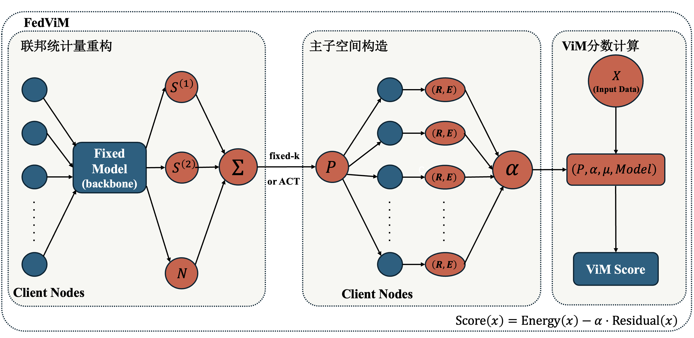

# FedViM：面向多中心海洋浮游生物监测的联邦分布外检测方法研究

## 摘要

海洋浮游生物图像监测通常由多个单位分别建设和维护本地数据中心。由于原始图像及其采样元信息可能关联采样海域、设备布放位置、时间节点和任务背景，跨中心直接汇聚原始数据往往受到数据治理和隐私约束。在此类多中心协作场景下，系统不仅需要提升联邦学习模型的分类精度，还需要识别未见类别、鱼卵、鱼尾、气泡和颗粒等非目标样本，即分布外（Out-of-Distribution, OOD）样本。

围绕这一需求，本文提出 `FedViM`，一种面向多中心海洋浮游生物监测的分布外检测方法。该方法能够利用各客户端上传的一阶与二阶特征充分统计量，通过联邦化重构出全局样本特征均值与协方差，进而构建出 ViM（Virtual-logit Matching）所需统计量，使得在不共享原始图像和单个样本特征的条件下完成 OOD 检测。本文进一步提出 `ACT-FedViM` 作为 `FedViM` 的扩展方法，使用 ACT（Adjusted Correlation Thresholding）机制替代原始 ViM 中的 fixed-k 经验设定，为主子空间维度 `k` 提供统计驱动的自适应选择。

本文在基于 DYB-PlanktonNet 构建的 OOD 数据划分上，对五个由联邦学习方式训练得到的 CNN 模型进行了评估。实验结果表明，`FedViM` 与 `ACT-FedViM` 的整体表现均优于 `MSP` 与 `Energy` 基线。`FedViM` 为多中心海洋浮游生物监测提供了一条可实现的联邦后处理 OOD 检测路径；`ACT-FedViM` 则在此基础上进一步降低了主子空间维度，在保持良好检测性能的同时提升了部署友好性。

**关键词**：联邦学习；分布外检测；ViM；ACT；海洋浮游生物；图像识别

## Abstract

Plankton image monitoring in the ocean is typically conducted by multiple institutions, each maintaining its own local data center. Because raw images and their associated metadata may reveal sensitive information such as sampling regions, device deployment locations, time stamps, and mission backgrounds, direct cross-center sharing of raw data is often constrained by data governance and privacy requirements. In such multi-center collaborative settings, the system must not only improve the classification accuracy of federated learning models, but also identify unseen categories and non-target samples such as fish eggs, fish tails, bubbles, and particles, namely out-of-distribution (OOD) samples.

To address this need, this paper proposes **FedViM**, an OOD detection method for multi-center marine plankton monitoring. By aggregating first- and second-order feature sufficient statistics uploaded from each client, the proposed method reconstructs the global feature mean and covariance, thereby obtaining the statistics required by **ViM** (Virtual-logit Matching) and enabling OOD detection without sharing raw images or individual sample features. Furthermore, this paper proposes **ACT-FedViM** as an extension of **FedViM**, replacing the fixed-$k$ heuristic in the original ViM with the **ACT** (Adjusted Correlation Thresholding) mechanism, so as to provide a statistically driven adaptive selection of the principal subspace dimension $k$.

Experiments are conducted on an OOD split constructed from **DYB-PlanktonNet**, using five CNN backbones trained under a federated learning setting. The results show that both **FedViM** and **ACT-FedViM** outperform the **MSP** and **Energy** baselines overall. **FedViM** provides a practical federated post-hoc OOD detection pathway for multi-center marine plankton monitoring, while **ACT-FedViM** further reduces the principal subspace dimension and improves deployment efficiency while maintaining strong detection performance.

**Keywords**: federated learning; out-of-distribution detection; ViM; ACT; marine plankton; image recognition

## 第1章 绪论

### 1.1 研究背景与意义

浮游生物是海洋生态系统中的基础组成部分，其丰度、群落结构和时空分布与营养盐循环、藻华暴发、食物网结构以及海洋生态安全密切相关。对浮游生物进行持续、准确和高效的监测，不仅关系到海洋生态过程的科学认识，也直接服务于海洋环境评估、生态预警和资源管理等实际需求[1]。随着显微成像设备、流式成像平台和深度学习识别技术的发展，浮游生物监测已经由低通量人工镜检逐步转向高通量图像分析[2-4]。在这一过程中，如何利用深度学习分类模型对海洋浮游生物进行更高效、更自动化的监测，已经逐渐成为海洋浮游生物监测领域的重要问题。

然而，面向真实业务场景的海洋浮游生物监测并不是一个理想化的集中式封闭分类任务。一方面，海洋浮游生物监测往往由不同海域、不同科研平台或不同业务单位分别建设和维护本地数据中心。不同中心在采样环境、成像设备、类别分布和标注进度上存在明显差异，原始图像及其采样元信息还可能关联采样位置、设备布放和任务背景等敏感内容，因此跨中心直接汇聚原始数据并不总是可行。对于这类多中心协作的场景，如何能够在不直接上传原始图像数据和单个样本特征的前提下利用各中心数据，已经成为海洋监测领域的关键课题。联邦学习通过“数据保留在本地、模型更新在中心间聚合”的方式，为此类多中心协作场景提供了可行方案[5-7]。

另一方面，海洋浮游生物监测具有显著的开放世界特征。即使分类模型已经学习了训练集中定义的已知类别（in-distribution，ID），但真实场景下仍不可避免地出现未见浮游生物类别、鱼卵、鱼尾、气泡和颗粒杂波等样本。如果系统对这些样本给出高置信度误判，将直接影响监测结果的可靠性。因此，在真实部署条件下，仅仅提高 ID 类别上的分类准确率并不足以保证系统可用性，模型还需要具备对未知类别的拒识能力。因此，多中心海洋浮游生物监测所面临的，不只是分类精度问题，更是在原始图像数据不能汇聚的约束下进行分布外样本检测的问题。

基于上述背景，本文关注的核心问题是：**在不共享原始图像的多中心海洋浮游生物监测场景下，如何为联邦化的图像识别任务构建可实现、可复用的 OOD 检测方法。**对于这一问题，后处理式 OOD 检测能展现出良好的适用性。对于已经完成联邦训练的分类模型，后处理方法能够在不重新设计训练框架、不引入额外生成模型的前提下提供 OOD 检测能力。这种即插即用与轻量化的特性，使其能够更容易地部署在现有的多中心海洋浮游生物监测系统中。围绕这一思路，研究联邦场景下的后处理 OOD 检测方法，不仅具有明确的理论意义，也具有较强的实际应用价值。

### 1.2 国内外研究现状

海洋浮游生物图像识别已经从低通量人工镜检逐步发展到自动分类、高通量分析和现场部署[2-4]。相关研究一方面关注显微成像或流式成像条件下的自动识别流程，另一方面也面向边缘部署、实时监测和海上自适应采样等应用方向展开探索[3][4]。这表明，海洋浮游生物图像识别正在从实验室条件下的离线分类任务逐步走向真实业务场景。然而，与封闭集图像分类不同，真实海洋环境中的样本分布会受到海域差异、成像条件、季节变化和设备差异等多种因素影响，系统面临的并不只是已知类别之间的分类问题，还需要能够识别出开放世界中的未知物种。已有研究已经从数据分布偏移（dataset shift）[8]、开放集识别（open-set recognition）[9] 和分布外（out-of-distribution, OOD）检测[10] 等角度讨论了海洋浮游生物监测系统在真实部署中的失效风险。这说明，海洋浮游生物识别在实际应用中不仅是分类问题，也是开放世界的识别问题。

在多中心海洋监测场景下，这一问题又进一步受到数据协作方式的约束，而无法采用集中式训练。现有工作普遍将联邦学习视为多中心数据协作的重要框架。FedAvg[5] 建立了最经典的参数平均范式，其基本思想是各客户端保留原始数据，仅上传模型参数在服务器进行聚合。此后，大量研究围绕其通信效率、非独立同分布数据（non-IID）和隐私保护等问题展开，逐步扩展了联邦学习的理论与应用边界[6][7]。现有研究大体可以分为两类：一类主要关注标准联邦分类训练的准确率、收敛性和系统效率[5][6]；另一类则更强调异构场景下的隐私保护、个性化适配和应用部署[7]。随着 OOD 问题在真实部署中的重要性不断提高，已有工作也开始关注联邦场景下的 OOD 检测[11]。但现有联邦 OOD 方法往往与训练阶段的额外模块或生成式结构高度耦合，带来额外计算开销和实现复杂度。相比之下，对于已经完成联邦训练的分类模型，后处理式（post-hoc）OOD 检测无需重新设计训练框架，且兼具轻量化与“即插即用”的适配性，更适合作为多中心联邦识别系统的扩展。

后处理式 OOD 检测方法以已训练完成的分类模型为基础，不需要重新训练完整系统，部署成本较低，也更容易与现有任务兼容。现有方法大体可以分为两类：一类主要利用输出空间信息，另一类进一步利用特征空间结构。输出空间方法中，`MSP`[12] 通过最大 softmax 概率刻画模型置信度，是最经典的 OOD 基线之一；`Energy`[13] 则利用 logits 的 log-sum-exp 构造能量分数，在多个视觉任务上表现出较强竞争力。与这类方法相比，特征空间方法进一步利用中间特征与分类结果之间的几何关系。ViM（Virtual-logit Matching）[14] 通过主子空间与残差空间分解，结合特征空间结构与 logits 来刻画样本偏离 ID 分布的程度，在多个视觉任务中表现出较强竞争力。在海洋浮游生物 OOD benchmark 上，Han 等[10] 对 `22` 种方法进行了统一比较，结果显示 ViM 在该基准上整体表现突出，并在 Far-OOD 场景中优势较为明显。从方法结构上来看，ViM 依赖全局特征均值与协方差，使其能够适配统计量可聚合的联邦学习场景。

尽管 ViM 为后处理式 OOD 检测提供了较有竞争力的技术路线，但在其实际应用中仍存在一个关键问题，即主子空间维度 `k` 的设定通常依赖经验选择[14]。固定维度方案（fixed-k）虽然实现简单，但不同模型的网络结构和特征维度差异明显，经验式 fixed-k 设定往往缺乏统一的统计依据，并可能在不同模型之间带来适配性差异。此外，当 `k` 取值过大时，部署阶段需要保存的投影矩阵规模和计算 OOD 分数的开销都会增加，不利于后处理模块的轻量化落地。在高维统计场景中，当特征维度与样本量处于相近量级时，样本协方差的特征值容易受到噪声膨胀影响，因此如何从样本协方差或相关矩阵中估计有效维度，已成为一条独立的重要研究线索。ACT（Adjusted Correlation Thresholding）[15] 属于这一方向的代表方法，它通过相关矩阵谱修正与阈值判别估计因子数量，从而为高维特征空间中的有效维度选择提供数据驱动依据。就 ViM 而言，这类方法为主子空间维度选择提供了可借鉴的统计工具。

综上，已有研究分别从浮游生物开放环境识别、多中心数据协作、后处理式 OOD 检测以及高维统计选维等方面提供了重要基础：真实海洋监测提出了面向 OOD 样本的检测需求，多中心协作使这一需求需要在联邦框架下讨论，ViM 为已完成训练的分类模型提供了 OOD 检测路径，而高维统计中的有效维度选择方法则为 ViM 的主子空间构造提供了统计学支撑。然而，现有研究仍缺少一种能够面向多中心海洋浮游生物监测的分布外检测方法，使其在不共享原始图像的条件下复用联邦分类模型，并以后处理方式同时实现 OOD 检测与主子空间维度自适应选择。

### 1.3 本文主要工作

针对上述研究缺口，本文围绕联邦后处理 OOD 检测展开研究。在不共享原始图像和单个样本特征的前提下，将 ViM 所需统计量的计算改写为联邦充分统计量聚合过程，构造 `FedViM`；同时，针对其主子空间维度选择问题，引入 ACT 构造 `ACT-FedViM`，以实现具有统计学依据的自适应选择。具体而言，本文主要完成了以下工作：

1. 面向多中心海洋浮游生物监测场景，将 ViM 引入联邦学习框架，提出了 `FedViM`。各客户端仅上传一阶与二阶特征充分统计量，服务器据此完成全局均值与协方差重构，在不共享原始图像和单个样本特征的条件下获得 ViM 所需的全局统计量。
2. 针对 `FedViM` 主子空间维度的选择问题，提出了 `ACT-FedViM` 方法，用统计驱动的方式代替固定的维度选择，在保持 OOD 检测性能的同时进一步压缩主子空间维度，增强对不同分类模型的适应性。
3. 在五个 CNN 模型上对 `MSP`、`Energy`、`FedViM` 和 `ACT-FedViM` 的 OOD 检测性能进行了系统评估。

全文结构如下：第 2 章给出 `FedViM` 与 `ACT-FedViM` 的方法设计；第 3 章介绍数据集、联邦设置、实现细节与评估指标；第 4 章展示五个 CNN 模型上的实验结果，并对 `FedViM` 与 `ACT-FedViM` 的性能进行分析；第 5 章给出全文结论，并讨论当前工作的局限与后续研究方向。

---

## 第2章 方法

### 2.1 问题设定与整体框架

设共有 $N$ 个客户端，每个客户端对应一个本地数据中心或数据持有单位。客户端 $i$ 持有本地有标签的 ID 训练集

$$
\mathcal{D}_i=\{(x_j^{(i)},y_j^{(i)})\}_{j=1}^{n_i},
$$

其中，$x_j^{(i)}$ 表示浮游生物图像，$y_j^{(i)}$ 表示对应的 ID 类别标签，$n_i=|\mathcal{D}_i|$ 为客户端 $i$ 的样本数。各客户端之间不共享原始图像。我们关注的任务是：在联邦学习得到的分类模型基础上，通过后处理方式构建 OOD 检测器，使系统能够识别测试样本是否为 OOD 样本。

图 2-1 FedViM 与 ACT-FedViM 的联邦后处理流程图

算法整体框架如图 2-1 所示，可概括为以下三个环节：

1. **联邦统计量重构**：客户端在本地 ID 训练集上计算一阶与二阶特征统计量，服务器据此重构全局特征均值与协方差；
2. **主子空间构造**：在上述全局统计量基础上，`FedViM` 采用固定维度 $k$ 构造主子空间，`ACT-FedViM` 则利用 ACT[15] 自适应确定 $k$。在主子空间确定后，各客户端进一步计算本地能量项与残差项的标量统计量，服务器聚合得到全局经验校准系数 $\alpha$。
3. **ViM 分数计算**：在得到主子空间、校准系数 $\alpha$ 与特征均值 $\mu$ 后，给定测试样本 $x$，计算其残差和 logit，并利用校准系数 $\alpha$ 加权求和得到最终的 OOD 评分。

### 2.2 FedViM 与 ACT-FedViM 的构造

ViM[14] 依赖全局特征均值与协方差来描述 ID 分布的特征结构。为在不访问原始图像和逐样本特征的条件下获得这些统计量，客户端 $i$ 在本地 ID 训练集上计算如下充分统计量：

$$
\begin{aligned}
s_i^{(1)} &= \sum_{x\in\mathcal{D}_i} f_\theta(x),\\
s_i^{(2)} &= \sum_{x\in\mathcal{D}_i} f_\theta(x)f_\theta(x)^\top,\\
n_i &= |\mathcal{D}_i|.
\end{aligned}
$$

服务器对各客户端上传结果进行聚合：

$$
\begin{aligned}
S^{(1)} &= \sum_{i=1}^{N}s_i^{(1)},\\
S^{(2)} &= \sum_{i=1}^{N}s_i^{(2)},\\
n &= \sum_{i=1}^{N}n_i.
\end{aligned}
$$

由此可得全局特征均值与协方差：

$$
\mu_{\text{global}}=\frac{S^{(1)}}{n},
\qquad
\Sigma_{\text{global}}=\frac{S^{(2)}}{n}-\mu_{\text{global}}\mu_{\text{global}}^\top.
$$

上述结果表明，ViM 所需的全局统计量可以通过联邦聚合充分统计量得到，而不需要服务器访问原始图像或样本级特征。基于此，可在联邦场景下复现 ViM 的特征几何结构。

在此基础上，我们首先构造 `FedViM`。该方法采用固定维度 $k$ 构造 ViM 主子空间。考虑到不同模型的特征维度存在差异，实验中对较低维模型取 $k=512$，对较高维模型取 $k=1000$。在得到协方差矩阵 $\Sigma_{\text{global}}$ 后，对其进行特征分解，并取前 $k$ 个协方差主方向构造主子空间矩阵

$$
P\in\mathbb{R}^{D\times k},
$$

其中 $D$ 为特征维度。由此得到固定维度版本的联邦 ViM，即 `FedViM`。

进一步地，本文在相同联邦统计量基础上引入 ACT，以构造 `ACT-FedViM`，为主子空间维度 $k$ 提供数据驱动的选择依据。具体而言，先将全局协方差矩阵转换为相关矩阵：

$$
R=D_\Sigma^{-1/2}\Sigma_{\text{global}}D_\Sigma^{-1/2},
$$

其中，$D_\Sigma$ 为由 $\Sigma_{\text{global}}$ 对角元素构成的对角矩阵。对 $R$ 进行特征分解，设其降序特征值为

$$
\lambda_1\ge \lambda_2\ge \cdots \ge \lambda_p,
$$

其中 $p$ 为特征维度。根据 ACT，定义阈值

$$
s=1+\sqrt{\frac{p}{n-1}},
$$

并通过离散 Stieltjes 变换对样本特征值进行偏差修正，得到修正特征值 $\lambda_j^C$。最终采用如下规则确定自适应维度：

$$
k_{\text{ACT}}=\max\{j:\lambda_j^C>s\}.
$$

在得到 $k_{\text{ACT}}$ 后，仍对 $\Sigma_{\text{global}}$ 进行 PCA，并取前 $k_{\text{ACT}}$ 个协方差主方向构造主子空间矩阵

$$
P\in\mathbb{R}^{D\times k_{\text{ACT}}}.
$$

因此，`ACT-FedViM` 与 `FedViM` 在主子空间的构造基础上保持一致，区别仅在于前者利用 ACT 自适应确定维度 $k$，而后者采用固定经验设定。

### 2.3 联邦经验校准与 OOD 评分

给定测试样本 $x$，记其特征为 $z=f_\theta(x)$，分类头输出 logits 为 $g_\theta(x)\in\mathbb{R}^{C}$，其中 $C$ 为 ID 类别数。ViM 的残差项定义为

$$
\text{Residual}(x)=\left\|(I-PP^\top)(z-\mu_{\text{global}})\right\|_2.
$$

能量项定义为

$$
\text{Energy}(x)=\log\sum_{c=1}^{C}\exp(g_\theta(x)_c).
$$

为平衡能量项与残差项的量纲，本文采用经验方式估计校准系数 $\alpha$：

$$
\alpha=\frac{\mathbb{E}_{ID}[\text{Energy}(x)]}{\mathbb{E}_{ID}[\text{Residual}(x)]},
$$

在联邦场景下，上式中的期望通过客户端本地统计量聚合获得。在主子空间 $P$ 与全局均值 $\mu_{\text{global}}$ 固定后，客户端 $i$ 在本地 ID 训练集上计算

$$
S_i^{E}=\sum_{x\in\mathcal{D}_i}\text{Energy}(x),\qquad
S_i^{R}=\sum_{x\in\mathcal{D}_i}\text{Residual}(x),\qquad
n_i=|\mathcal{D}_i|.
$$

服务器聚合得到

$$
S^{E}=\sum_{i=1}^{N}S_i^{E},\qquad
S^{R}=\sum_{i=1}^{N}S_i^{R},\qquad
n=\sum_{i=1}^{N}n_i.
$$

于是，

$$
\mathbb{E}_{ID}[\text{Energy}(x)]\approx \frac{S^{E}}{n},
\qquad
\mathbb{E}_{ID}[\text{Residual}(x)]\approx \frac{S^{R}}{n},
$$

从而得到联邦经验校准系数

$$
\alpha=\frac{S^{E}/n}{S^{R}/n}.
$$

最终，定义样本 $x$ 的联合评分为

$$
\text{Score}(x)=\text{Energy}(x)-\alpha\cdot \text{Residual}(x).
$$

当 $\text{Score}(x)$ 较小时，样本更可能偏离 ID 分布，因此更可能是 OOD 样本。由此，`FedViM` 与 `ACT-FedViM` 的评分框架保持一致，二者的差异仅在于主子空间矩阵 $P$ 的构造方式不同。

此外，部署阶段需要保存主子空间矩阵 $P\in\mathbb{R}^{D\times k}$，而 ViM 打分中涉及的投影与残差计算复杂度近似为 $O(Dk)$。因此，更小的 $k$ 将直接减少后处理模块的存储开销与计算开销，这也是 `ACT-FedViM` 相较于 fixed-k `FedViM` 的一个重要部署优势。

---

## 第3章 实验设计

### 3.1 数据集、OOD 划分与联邦实验设定

本文实验基于 Li 等发布于 IEEE Dataport 的 `DYB-PlanktonNet` 数据集[16] 和 Han 等[10] 的工作构建了 OOD 检测任务。结合本文研究目标，实验数据被组织为以下四个部分：

- `D_ID_train`：`54` 个 ID 类别，共 `26,034` 张图像；
- `D_ID_test`：`54` 个 ID 类别，共 `2,939` 张图像；
- `D_Near_test`：`26` 个 Near-OOD 类别，共 `1,516` 张图像；
- `D_Far_test`：`12` 个 Far-OOD 类别，共 `17,031` 张图像。

其中，`D_ID_train` 用于联邦分类训练与后处理统计量估计，`D_ID_test` 用于评估联邦模型在已知类别上的分类性能，`D_Near_test` 与 `D_Far_test` 分别用于评估模型在相近未知类和明显非目标类上的 OOD 检测能力。Near-OOD 主要由与 ID 浮游生物在形态结构或生态属性上较为接近、但不属于训练目标的类别构成；Far-OOD 则包含鱼卵、鱼尾、气泡以及多类颗粒杂波，更接近真实海洋监测中可能出现的非目标样本。上述划分同时覆盖了“相近未知类”和“明显非目标类”两种更贴近实际部署需求的 OOD 场景。

在训练阶段，本文从 `D_ID_train` 中固定划出 `10%` 样本作为服务端验证集，用于 early stopping 和最佳 checkpoint 选择；`D_ID_test`、`D_Near_test` 与 `D_Far_test` 仅用于最终评估，不参与模型训练与模型选择。

为模拟多中心数据协作场景，本文采用 Dirichlet 分布将 `D_ID_train` 划分到 `5` 个客户端，参数取 `alpha = 0.1`，以构造高度异构的非独立同分布数据分片。全局训练采用 FedAvg 聚合，客户端参与比例设为 `1.0`，即每一轮通信均使用全部客户端参与参数更新。正式训练统一设置为 `50` 个通信轮次，每轮执行 `4` 个本地 epoch。上述设定旨在在较强数据异构条件下考察联邦分类模型的训练效果，以及后续 `FedViM` 与 `ACT-FedViM` 的联邦后处理可行性。

### 3.2 对比方法、模型范围与实现细节

为考察所提方法在不同网络结构下的适用性，本文选取五个具有代表性的 CNN 模型作为实验对象，包括 `DenseNet169`、`ResNet50`、`ResNet101`、`EfficientNetV2-S` 和 `MobileNetV3-Large`。其中，`DenseNet169`、`ResNet50` 和 `ResNet101` 代表较为经典的卷积神经网络结构，`EfficientNetV2-S` 与 `MobileNetV3-Large` 则代表兼顾效率与性能的现代轻量化 CNN 结构。通过在不同模型上进行统一比较，可以更全面地评估联邦后处理 OOD 方法的稳定性与适配性。

在方法对照方面，本文比较四类后处理式 OOD 检测方法：`MSP`、`Energy`、`FedViM` 和 `ACT-FedViM`。其中，`MSP` 与 `Energy` 作为经典输出空间后处理基线，用于提供基本参照；`FedViM` 对应联邦场景下的固定维度 ViM 实现；`ACT-FedViM` 则在相同联邦统计量和相同分类模型的基础上，仅对主子空间维度 `k` 的选取方式进行替换，从而考察 ACT 自适应选维对 OOD 检测性能与部署效率的影响。

在训练实现上，五个 CNN 模型采用统一的联邦训练框架。主要配置如下：

- 全局随机种子设置为 `42`；
- 通信轮次为 `50`，每轮本地训练 `4` 个 epoch；
- 基础学习率设为 `0.001`；
- 优化器采用带动量的 SGD，动量为 `0.9`；
- 权重衰减设为 `1e-4`；
- 学习率调度采用 `5` 轮 warmup 与 cosine decay 相结合的方式。

在后处理评估中，`FedViM` 采用 fixed-k 设定；`ACT-FedViM` 仅改变主子空间维度 `k` 的选择方式，而特征提取器、联邦统计量、ViM 打分方式以及经验 `\alpha` 校准过程均与 `FedViM` 保持一致。这样的实验设计可以尽可能减少额外变量的干扰，使比较结果更集中地反映固定选维与自适应选维之间的差异。

### 3.3 评估指标与分析维度

为全面评估联邦后处理 OOD 检测方法的性能，本文从分类能力、近域拒识能力、远域拒识能力以及后处理轻量化收益四个维度进行分析，并采用如下指标进行衡量。

首先，使用 ID 分类准确率（Accuracy）衡量联邦分类模型在 `D_ID_test` 上的基础识别能力。该指标反映分类模型本身对已知类别的判别效果，是后续 OOD 检测的基础。

其次，使用 Near-OOD AUROC 衡量模型对 `D_Near_test` 中相近未知类别的区分能力。由于 Near-OOD 样本在形态结构上通常与 ID 类别较为接近，因此该指标能够更直接反映方法对细粒度未知类的识别难度。

然后，使用 Far-OOD AUROC 衡量模型对 `D_Far_test` 中明显非目标样本的区分能力。相较于 Near-OOD，Far-OOD 通常与 ID 类别差异更大，因此该指标主要用于评估方法在更宽松 OOD 场景下的整体拒识能力。

最后，为刻画 `ACT-FedViM` 相对于 fixed-k `FedViM` 在后处理阶段的压缩效果，本文定义主子空间压缩率为

$$
\text{Compression} = 1 - \frac{k_{\text{ACT}}}{k_{\text{fixed}}}.
$$

其中，$k_{\text{fixed}}$ 表示 `FedViM` 中采用的固定主子空间维度，$k_{\text{ACT}}$ 表示 `ACT-FedViM` 中通过 ACT 自适应确定的主子空间维度。该指标用于衡量自适应选维在降低后处理存储与计算开销方面的潜在收益。

综合而言，Accuracy 用于衡量联邦分类模型的已知类识别能力，Near-OOD AUROC 与 Far-OOD AUROC 分别对应相近未知类与明显非目标样本的拒识能力，而 Compression 则用于刻画 `ACT-FedViM` 在部署效率方面的附加价值。四类指标共同构成了本文实验结果分析的基本依据。

---

## 第4章 实验结果与分析

### 4.1 总体结果与主要发现

表 4-1 给出了五个 CNN 模型上 `FedViM` 与 `ACT-FedViM` 的主要结果。

**表 4-1 五个 CNN 模型上的主要结果**

| 模型              | ID Acc (%) | FedViM k  | ACT k     | 压缩率    | FedViM Near (%) | ACT Near (%) | FedViM Far (%) | ACT Far (%) |
| ----------------- | ---------- | --------- | --------- | --------- | --------------- | ------------ | -------------- | ----------- |
| DenseNet169       | 96.50      | 1000      | 99        | 90.1%     | 80.04           | 95.57        | 84.78          | 96.17       |
| EfficientNetV2-S  | 97.01      | 512       | 69        | 86.5%     | 96.40           | 95.77        | 97.52          | 96.51       |
| MobileNetV3-Large | 96.16      | 512       | 89        | 82.6%     | 96.31           | 95.26        | 97.34          | 96.42       |
| ResNet101         | 96.22      | 1000      | 143       | 85.7%     | 95.86           | 96.28        | 96.68          | 96.73       |
| ResNet50          | 96.53      | 1000      | 141       | 85.9%     | 95.68           | 95.32        | 97.19          | 95.89       |
| **平均**          | **96.48**  | **804.8** | **108.2** | **86.2%** | **92.86**       | **95.64**    | **94.70**      | **96.34**   |

*图 4-1 五个 CNN 模型上 fixed-k `FedViM` 与 `ACT-FedViM` 的主子空间维度比较。*

从表 4-1 和图 4-1 可以发现，首先，`ACT-FedViM` 在五款模型上均显著降低了主子空间维度。相较于 fixed-k `FedViM`，ACT 选择的 `k` 均落在 `69` 至 `143` 的范围内，平均维度由 `804.8` 降至 `108.2`，平均压缩率达到 `86.2%`。这表明，ACT 在当前实验范围内稳定地缩小了 ViM 后处理所需的主子空间规模。

其次，从平均结果看，`ACT-FedViM` 的 Near-OOD AUROC 和 Far-OOD AUROC 分别由 `92.86%` 提升至 `95.64%`、由 `94.70%` 提升至 `96.34%`。但这一平均增益并不在所有模型上均匀出现：从逐模型结果看，ACT 在 `DenseNet169` 和 `ResNet101` 上带来性能提升，而在其余三款模型上则出现了轻微衰减。

除检测性能外，主子空间维度的降低还具有明确的部署含义。ViM 后处理需要保存主子空间矩阵 $P \in \mathbb{R}^{D \times k}$，并在打分阶段完成投影与残差计算，因此更小的 $k$ 直接对应更低的存储开销与计算开销。因此，ACT-FedViM 的更稳定收益主要体现在主子空间压缩与后处理轻量化，而其 AUROC 增益则具有一定模型依赖性。

### 4.2 与 MSP、Energy 基线的整体比较

为了说明联邦 ViM 系方法的整体有效性，表 4-2 给出了四类方法在五个模型上的平均表现。

**表 4-2 不同方法的平均 OOD 检测表现**

| 方法       | 平均 Near-OOD AUROC (%) | 平均 Far-OOD AUROC (%) |
| ---------- | ----------------------- | ---------------------- |
| MSP        | 90.42                   | 87.27                  |
| Energy     | 83.34                   | 80.89                  |
| FedViM     | 92.86                   | 94.70                  |
| ACT-FedViM | 95.64                   | 96.34                  |

*图 4-2 五个 CNN 模型上 `FedViM`、`ACT-FedViM`、`MSP` 与 `Energy` 的 Near/Far-OOD AUROC 对比。*

从表 4-2 和图 4-2 可以看出，基于特征空间结构的 ViM 系方法整体上优于纯输出空间基线。以平均结果计，`FedViM` 相比 `MSP` 的 Near-OOD 与 Far-OOD AUROC 分别提高 `2.44` 和 `7.43` 个百分点，相比 `Energy` 分别提高 `9.51` 和 `13.82` 个百分点；`ACT-FedViM` 相比 `MSP` 的 Near-OOD 与 Far-OOD AUROC 分别提高 `5.22` 和 `9.08` 个百分点，相比 `Energy` 分别提高 `12.30` 和 `15.46` 个百分点。

值得注意的是，在当前细粒度浮游生物任务中，`Energy` 的平均表现甚至低于 `MSP`。这一现象表明，单纯依赖输出空间置信度或能量信息的方法在该任务上存在明显局限；相比之下，利用特征空间结构信息的 ViM 系方法更适合当前 OOD 检测场景。由此可见，联邦化 ViM 本身已经构成一条有效的后处理路线。

### 4.3 代表模型分析

为覆盖不同模型上 ACT 收益的代表性结果形态，本文选取 `MobileNetV3-Large`、`ResNet101` 和 `DenseNet169` 三个模型进行进一步分析。三者分别对应以下三种典型情形：`MobileNetV3-Large` 在大幅压缩主子空间的同时性能仅出现有限波动；`ResNet101` 在显著压缩维度的同时保持与 fixed-k 方法接近甚至略优的检测能力；`DenseNet169` 则表现出 fixed-k 与自适应选维之间较大的结果差异。

*图 4-3 `MobileNetV3-Large`、`ResNet101` 与 `DenseNet169` 三个代表模型上的 Near/Far-OOD AUROC 对比。*

图 4-3 展示了三类代表模型的差异模式。`MobileNetV3-Large` 对应“高性能前提下的大幅压缩”，`ResNet101` 对应“压缩与性能的相对平衡”，而 `DenseNet169` 则体现了 fixed-k 与自适应选维结果之间的显著差异。

`MobileNetV3-Large` 的 fixed-k 为 `512`，而 ACT 选择的主子空间维度为 `89`，压缩率达到 `82.6%`。在此基础上，Near-OOD AUROC 由 `96.31%` 变化为 `95.26%`，Far-OOD AUROC 由 `97.34%` 变化为 `96.42%`。这一结果表明，在较轻量的 CNN 模型上（`MobileNetV3-Large` 的参数量仅为 `3.02M`，`ResNet101` 的参数量为 `42.61M`，`DenseNet169` 的参数量为 `12.57M`），ACT 的主要收益并不一定表现为进一步提升 AUROC，而更多表现为在维持较高绝对性能的同时显著减小主子空间规模。

`ResNet101` 的 fixed-k 为 `1000`，ACT 选择 `143` 维主子空间，压缩率为 `85.7%`。在更小主子空间下，Near-OOD AUROC 由 `95.86%` 提升至 `96.28%`，Far-OOD AUROC 由 `96.68%` 变化至 `96.73%`。这一结果说明，在高维 CNN 模型上，`ACT-FedViM` 可以在显著缩小子空间规模的同时保持与 fixed-k 方法基本一致的检测能力，并取得轻微增益。

`DenseNet169` 的 fixed-k 为 `1000`，而 ACT 仅保留 `99` 维主子空间，压缩率达到 `90.1%`。在此设定下，Near-OOD AUROC 由 `80.04%` 提升至 `95.57%`，Far-OOD AUROC 由 `84.78%` 提升至 `96.17%`。与其他模型相比，该模型上 fixed-k 与自适应选维之间的差异最为显著。

从当前结果分析，`DenseNet169` 的网络架构对主子空间维度的选择较为敏感。fixed-k 方法保留了较高的主子空间维度，使其残差空间被大幅压缩，从而导致 OOD 检测性能下降。综合三类代表模型可以看出，ACT 并不能一致提升 OOD 检测的 AUROC，其价值在于提供了统计驱动的、更紧凑的选维方式，并在某些特定模型架构上缓解了 fixed-k 可能带来的失配风险。

## 第5章 结论与展望

本文围绕多中心海洋浮游生物监测场景下“原始图像难以跨中心共享，而监测系统又需要具备 OOD 拒识能力”的问题，研究了联邦后处理 OOD 检测方法。针对这一问题，本文提出了 `FedViM`，并在此基础上进一步构造了其自适应选维扩展 `ACT-FedViM`。其中，`FedViM` 通过联邦聚合一阶与二阶充分统计量，实现了 ViM 所需全局特征均值与协方差的重构；`ACT-FedViM` 则在利用 ACT 自动选择主子空间维度 `k`，从而形成一套统计驱动的联邦 ViM 后处理方法。

在基于 `DYB-PlanktonNet` 构建的 OOD 划分上，本文对 `5` 个 CNN 模型进行了实验评估。结果表明，联邦化 ViM 路线在该任务上是可行的：五模型平均 ID 分类准确率达到 `96.48%`，说明联邦分类模型具备较好的已知类识别能力；与 `MSP` 和 `Energy` 两类输出空间基线相比，`FedViM` 与 `ACT-FedViM` 在 Near-OOD 和 Far-OOD 检测上整体表现更优，说明利用特征空间结构信息的后处理方法更适合当前细粒度浮游生物 OOD 场景。

综合全文的理论分析与实验结果，本文得到以下几点主要结论：

1. ViM 所需的全局特征统计量可以通过联邦充分统计量聚合完成重构，从而形成可实现的联邦后处理 OOD 检测流程。
2. ACT 可以作为联邦 ViM 的自适应选维模块接入已经训练好的分类模型的后处理评估，为主子空间维度选择提供数据驱动的统计依据。
3. `ACT-FedViM` 的主要价值并不完全体现在 AUROC 提升上，而更多体现在统计驱动的选维方式、压缩后处理主子空间规模以及提升部署友好性等方面。

总体而言，`FedViM` 给出了联邦场景下实现 ViM 后处理 OOD 检测的可行方案，`ACT-FedViM` 则在此基础上进一步提高了后处理模块的紧凑性与对不同模型的适应性。

尽管本文在联邦后处理 OOD 检测方面进行了初步探索，但当前工作仍存在一定局限。

（1）本文对 ViM 的改进主要体现在主子空间维度 `k` 的选择上，没有改变主子空间与残差空间的构造方式。因此，当 OOD 判别信息没有落在样本协方差矩阵的残差空间时，自适应选维所能带来的性能改善仍然是有限的。未来可在保持联邦统计量可聚合的前提下，进一步研究 OOD 判别信息的结构，设计出能够涵盖更多 OOD 判别信息的选维机制。

（2）本文的方法虽然避免了原始图像和逐样本特征的跨中心传输，但在传输统计量时并没有引入隐私机制来给出数学上的隐私保证。因此，后续研究可在统计量聚合流程中引入安全聚合、差分隐私扰动或其他隐私保护机制，进一步提升多中心海洋浮游生物监测系统的隐私保护能力。

---

## 参考文献

[1] Naselli-Flores L, Padisak J. Ecosystem services provided by marine and freshwater phytoplankton[J]. Hydrobiologia, 2023, 850(12-13): 2691-2706.
[2] Eerola T, Kareinen J, Pitois S G, et al. Survey of automatic plankton image recognition: challenges, existing solutions and future perspectives[J]. Artificial Intelligence Review, 2024, 57(5): 114.
[3] Pitois S G, Schmid M S, Eerola T, et al. RAPID: real-time automated plankton identification dashboard using Edge AI at sea[J]. Frontiers in Marine Science, 2025, 11: 1513463.
[4] Schmid M S, Eerola T, Pitois S G, et al. Edge computing at sea: high-throughput classification of in-situ plankton imagery for adaptive sampling[J]. Frontiers in Marine Science, 2023, 10: 1187771.
[5] McMahan B, Moore E, Ramage D, et al. Communication-efficient learning of deep networks from decentralized data[C]//Singh A, Zhu J, eds. Proceedings of the 20th International Conference on Artificial Intelligence and Statistics. Fort Lauderdale, FL, USA: PMLR, 2017: 1273-1282.
[6] Kairouz P, McMahan H B, Avent B, et al. Advances and open problems in federated learning[J]. Foundations and Trends in Machine Learning, 2021, 14(1-2): 1-210.
[7] Yang Q, Liu Y, Chen T, et al. Federated machine learning: Concept and applications[J]. ACM Transactions on Intelligent Systems and Technology, 2019, 10(2): 12:1-12:19.
[8] Chen C, Kyathanahally S P, Reyes M, et al. Producing plankton classifiers that are robust to dataset shift[J]. Limnology and Oceanography: Methods, 2025, 23: 39-66.
[9] Kareinen J, Skyttä A, Eerola T, et al. Open-set plankton recognition[C]//Del Bue A, Leal-Taixe L, eds. Computer Vision - ECCV 2024 Workshops. Cham: Springer, 2025: 168-184.
[10] Han Y, He J, Xie C, et al. Benchmarking out-of-distribution detection for plankton recognition: a systematic evaluation of advanced methods in marine ecological monitoring[C]//Proceedings of the IEEE/CVF International Conference on Computer Vision Workshops. Piscataway, NJ, USA: IEEE, 2025: 2142-2152.
[11] Liao X, Liu W, Zhou P, et al. FOOGD: Federated collaboration for both out-of-distribution generalization and detection[C]//Advances in Neural Information Processing Systems. 2024, 37.
[12] Hendrycks D, Gimpel K. A baseline for detecting misclassified and out-of-distribution examples in neural networks[C/OL]//International Conference on Learning Representations. Toulon, France, 2017[2026-04-01]. https://openreview.net/forum?id=Hkg4TI9xl.
[13] Liu W, Wang X, Owens J, et al. Energy-based out-of-distribution detection[C]//Advances in Neural Information Processing Systems. Red Hook, NY, USA: Curran Associates, Inc., 2020, 33: 21464-21475.
[14] Wang H Q, Li Z, Feng L, et al. ViM: Out-of-distribution with virtual-logit matching[C]//Proceedings of the IEEE/CVF Conference on Computer Vision and Pattern Recognition. New Orleans, LA, USA: IEEE, 2022: 4911-4920.
[15] Fan J, Ke Y, Wang K, et al. Estimating number of factors by adjusted eigenvalues thresholding[J]. Journal of the American Statistical Association, 2022, 117(538): 852-861.
[16] Li J, Yang Z, Chen T. DYB-PlanktonNet[DB/OL]. IEEE Dataport, 2021[2026-04-01]. https://dx.doi.org/10.21227/875n-f104.

---

## 附录 1 全局协方差重构公式

设客户端 `i` 的本地特征为 `\{z_j^{(i)}\}_{j=1}^{n_i}`，则有

$$
\begin{aligned}
S^{(1)} &= \sum_{i=1}^{N}\sum_{j=1}^{n_i} z_j^{(i)}, \\
S^{(2)} &= \sum_{i=1}^{N}\sum_{j=1}^{n_i} z_j^{(i)}(z_j^{(i)})^\top.
\end{aligned}
$$

由此得到

$$
\mu_{\text{global}} = \frac{S^{(1)}}{\sum_i n_i},
\qquad
\Sigma_{\text{global}} = \frac{S^{(2)}}{\sum_i n_i} - \mu_{\text{global}}\mu_{\text{global}}^\top.
$$

因此，ViM 所需的全局统计量可以在联邦场景下通过充分统计量无损重构。

## 附录 2 五个模型完整结果

**表 A-1 五个模型完整结果**

| 模型 | ID Acc (%) | FedViM k | ACT k | 压缩率 | FedViM Near (%) | ACT Near (%) | MSP Near (%) | Energy Near (%) | FedViM Far (%) | ACT Far (%) | MSP Far (%) | Energy Far (%) |
| --- | --- | --- | --- | --- | --- | --- | --- | --- | --- | --- | --- | --- |
| DenseNet169 | 96.50 | 1000 | 99 | 90.1% | 80.04 | 95.57 | 88.60 | 77.11 | 84.78 | 96.17 | 79.22 | 66.15 |
| EfficientNetV2-S | 97.01 | 512 | 69 | 86.5% | 96.40 | 95.77 | 87.83 | 81.36 | 97.52 | 96.51 | 89.62 | 85.24 |
| MobileNetV3-Large | 96.16 | 512 | 89 | 82.6% | 96.31 | 95.26 | 93.05 | 87.23 | 97.34 | 96.42 | 92.56 | 89.42 |
| ResNet101 | 96.22 | 1000 | 143 | 85.7% | 95.86 | 96.28 | 91.59 | 87.06 | 96.68 | 96.73 | 90.12 | 86.65 |
| ResNet50 | 96.53 | 1000 | 141 | 85.9% | 95.68 | 95.32 | 91.02 | 83.97 | 97.19 | 95.89 | 84.82 | 76.97 |

## 附录3 核心算法实现代码

## 致谢
